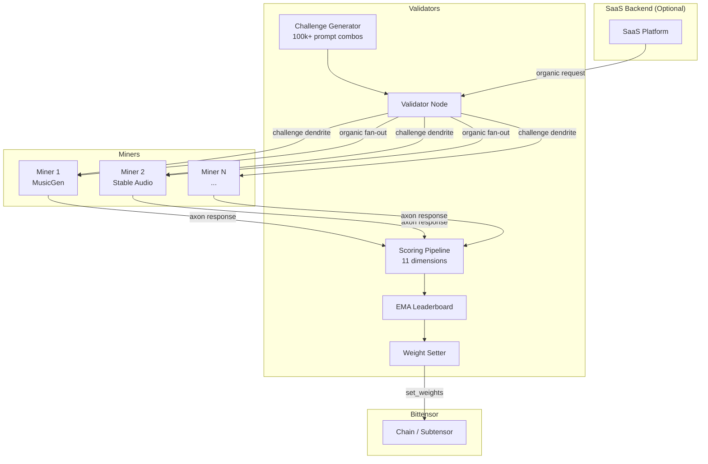
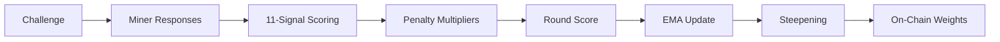

<div align="center">
  <picture>
    <source media="(prefers-color-scheme: dark)" srcset="assets/brand/banner-dark.png" />
    <source media="(prefers-color-scheme: light)" srcset="assets/brand/banner-light.png" />
    
  </picture>

  <p><strong>Decentralized AI Music Generation on Bittensor</strong></p>

  <a href="#"></a>
  <a href="LICENSE"></a>
  <a href="#"></a>
</div>

---

TuneForge is a Bittensor subnet that incentivizes decentralized AI music generation. Miners compete to produce high-quality audio from text prompts, scored by validators across 11 quality dimensions. The subnet supports MusicGen and Stable Audio backends, with an EMA-based leaderboard that translates performance into on-chain weight and TAO emissions.

**Testnet netuid: 234** | **Mainnet: TBD**

## Table of Contents

- [Architecture](#architecture)
- [Quick Start](#quick-start)
- [Scoring System](#scoring-system)
- [Reward Mechanism](#reward-mechanism)
- [Anti-Gaming](#anti-gaming)
- [Configuration Reference](#configuration-reference)
- [Project Structure](#project-structure)
- [Roadmap](#roadmap)
- [License](#license)

## Architecture



**Validators** generate text-to-music challenges, distribute them to miners via dendrite, score the returned audio across 11 quality signals, maintain an EMA leaderboard, apply steepening, and submit weights on-chain.

**Miners** run a generation backend (MusicGen small/medium/large or Stable Audio), receive challenges via axon, and return generated audio. Higher-quality, faster generation earns more weight and TAO.

**Organic Generation** (optional) allows real user requests from the SaaS backend to flow through the validator. The validator fans out organic prompts to the top 10 miners by EMA, scores all responses with the same 11-signal pipeline, updates the EMA leaderboard, and returns the best results to the customer. Organic and challenge scoring coexist on the same event loop and feed the same EMA.

## Quick Start

### Prerequisites

- Python 3.10 - 3.12
- NVIDIA GPU with CUDA support (miners)
- A registered Bittensor wallet with a hotkey on subnet 234 (testnet)

### Installation

```bash
git clone https://github.com/tuneforge-ai/tuneforge.git
cd tuneforge
pip install -e .
```

Or use the setup script:

```bash
bash scripts/setup.sh
```

### Download Models

```bash
bash scripts/download_models.sh
```

### Run a Miner

Copy the example config and edit it:

```bash
cp .env.miner.example .env
# Edit .env with your wallet, netuid, and GPU settings
```

Launch:

```bash
bash scripts/run_miner.sh
# Or directly:
python neurons/miner.py
```

See [docs/miner_setup.md](docs/miner_setup.md) for the complete miner guide including GPU requirements, model selection, and tuning parameters.

### Run a Validator

```bash
cp .env.validator.example .env
# Edit .env with your wallet and netuid
```

Launch:

```bash
bash scripts/run_validator.sh
# Or directly:
python neurons/validator.py
```

See [docs/validator_setup.md](docs/validator_setup.md) for the complete validator guide.

### Docker

```bash
# Miner (GPU)
docker build -f Dockerfile.miner -t tuneforge-miner .
docker run --gpus all --env-file .env tuneforge-miner

# Validator (CPU)
docker build -f Dockerfile.validator -t tuneforge-validator .
docker run --env-file .env tuneforge-validator
```

For the full architecture reference and SaaS layer setup, see [docs/setup.md](docs/setup.md).

## Scoring System

Every validation round, miners are scored across 11 weighted signals. The weights are configurable via environment variables and must sum to 1.0.

### Scoring Signals

| Signal | Weight | Env Variable | Category |
|--------|--------|--------------|----------|
| CLAP Adherence | 30% | `TF_WEIGHT_CLAP` | Prompt Adherence |
| Musicality | 10% | `TF_WEIGHT_MUSICALITY` | Music Quality |
| Neural Quality (MERT) | 10% | `TF_WEIGHT_NEURAL_QUALITY` | Music Quality |
| Production Quality | 8% | `TF_WEIGHT_PRODUCTION` | Music Quality |
| Melody Coherence | 7% | `TF_WEIGHT_MELODY` | Music Quality |
| Structural Completeness | 7% | `TF_WEIGHT_STRUCTURAL` | Music Quality |
| Audio Quality | 6% | `TF_WEIGHT_QUALITY` | Music Quality |
| Preference Model | 6% | `TF_WEIGHT_PREFERENCE` | Music Quality |
| Vocal Quality | 6% | `TF_WEIGHT_VOCAL` | Music Quality |
| Diversity | 5% | `TF_WEIGHT_DIVERSITY` | Other |
| Speed | 5% | `TF_WEIGHT_SPEED` | Other |
| Attribute Verification | 0% | `TF_WEIGHT_ATTRIBUTE` | Other (opt-in) |

**CLAP Adherence** (30%) dominates the scoring: it measures how well the generated audio matches the text prompt using CLAP text-audio cosine similarity, mapped from a floor of 0.15 to a ceiling of 0.60.

**Neural Quality** uses the MERT model (`m-a-p/MERT-v1-95M`) to evaluate learned audio representations. **Musicality** analyzes pitch stability, harmonic consonance, and rhythmic regularity. **Production Quality** checks spectral balance, LUFS loudness, and dynamic range. The remaining signals cover melody, structure, audio fidelity, vocal clarity, output diversity, and generation speed.

### Penalties

Penalties are applied as multipliers on the final score, not as weighted components. They exist to enforce hard constraints and detect gaming.

| Penalty | Trigger | Effect |
|---------|---------|--------|
| Silence | Audio RMS below 0.01 | Hard zero -- final score = 0.0 |
| Timeout | Generation exceeds 120s (`TF_GENERATION_TIMEOUT`) | Hard zero -- final score = 0.0 |
| Plagiarism | Self-similarity > 0.80 via fingerprinting | Hard zero -- final score = 0.0 |
| Duration | Audio duration off-target by >20% | Linear penalty (1.0 at 20% to 0.0 at 50%) |
| Artifacts | Spectral discontinuities, clipping, loops | Multiplier (0.0 - 1.0) on final score |

### Speed Scoring Curve

Speed is scored on a nonlinear curve:
- 5s or faster = 1.0
- 30s = 0.3
- 60s or slower = 0.0

## Reward Mechanism



### EMA Leaderboard

Each miner's long-term performance is tracked via an exponential moving average:

```
ema_new = 0.2 * round_score + 0.8 * ema_old
```

New miners start with EMA = 0.0 and ramp up gradually through the EMA formula. A miner consistently scoring 0.7 takes ~8 rounds (~40 minutes) to cross the steepening baseline and begin receiving weight. This cold-start behaviour prevents a single good round from granting immediate ranking.

The EMA alpha of 0.2 (`TF_EMA_ALPHA`) balances responsiveness to recent performance with stability against outlier rounds.

### Steepening

Raw EMA scores are transformed before weight submission to reward top performers disproportionately:

1. Miners with EMA below the baseline of 0.50 (`TF_STEEPEN_BASELINE`) receive zero weight.
2. Miners above baseline are mapped: `weight = ((ema - 0.50) / 0.50) ^ 2.0`

The power of 2.0 (`TF_STEEPEN_POWER`) creates a convex curve that concentrates emissions on consistently high-performing miners.

### Weight Submission

Weights are submitted on-chain every 115 blocks (`TF_WEIGHT_UPDATE_INTERVAL`). Validation rounds run every 300 seconds (`TF_VALIDATION_INTERVAL`), with 8 miners challenged per round (`TF_CHALLENGE_BATCH_SIZE`).

## Anti-Gaming

TuneForge employs multiple mechanisms to prevent miners from gaming the scoring system:

**Weight Perturbation.** Each round, scoring weights are perturbed by up to 20% (`TF_WEIGHT_PERTURBATION=0.20`), seeded deterministically by the challenge ID. This prevents miners from over-optimizing for a fixed weight distribution while keeping scoring reproducible across validators.

**Diversity Tracking.** CLAP embeddings of each miner's recent outputs are tracked. Miners that produce nearly identical outputs across rounds are penalized through the diversity signal (5% weight).

**Plagiarism Detection.** Audio fingerprinting detects self-similarity above a threshold of 0.80 (`TF_SELF_PLAGIARISM_THRESHOLD`). Miners that replay or trivially modify previous outputs receive a hard zero for the round.

**Hard Penalties.** Silence detection (RMS < 0.01), timeout enforcement (120s), and artifact detection (clipping, spectral discontinuities, looping) act as binary or continuous multipliers that cannot be circumvented by high signal scores.

**EMA Smoothing.** The alpha of 0.2 means a single exceptional round cannot dramatically change a miner's standing. Consistent quality over time is required.

## Configuration Reference

All configuration is done through environment variables with the `TF_` prefix. Values can be set in a `.env` file or passed directly.

### Network

| Variable | Type | Default | Description |
|----------|------|---------|-------------|
| `TF_NETUID` | int | 0 | Subnet network UID |
| `TF_VERSION` | str | 1.0.0 | Protocol version |
| `TF_SUBTENSOR_NETWORK` | str | None | Network (finney, test, local) |
| `TF_SUBTENSOR_CHAIN_ENDPOINT` | str | None | Custom chain endpoint URL |

### Wallet

| Variable | Type | Default | Description |
|----------|------|---------|-------------|
| `TF_WALLET_NAME` | str | default | Wallet name |
| `TF_WALLET_HOTKEY` | str | default | Hotkey name |
| `TF_WALLET_PATH` | str | ~/.bittensor/wallets | Wallet path |

### Neuron

| Variable | Type | Default | Description |
|----------|------|---------|-------------|
| `TF_MODE` | str | miner | Runtime mode (miner/validator) |
| `TF_NEURON_EPOCH_LENGTH` | int | 100 | Blocks between weight updates |
| `TF_NEURON_TIMEOUT` | int | 120 | Forward timeout (seconds) |
| `TF_NEURON_AXON_OFF` | bool | false | Disable axon serving |
| `TF_AXON_PORT` | int | None | Axon port |

### Generation (Miner)

| Variable | Type | Default | Description |
|----------|------|---------|-------------|
| `TF_MODEL_NAME` | str | facebook/musicgen-medium | MusicGen model name |
| `TF_GENERATION_MAX_DURATION` | int | 30 | Max generation duration (s) |
| `TF_GENERATION_SAMPLE_RATE` | int | 32000 | Audio sample rate (Hz) |
| `TF_GENERATION_TIMEOUT` | int | 120 | Generation timeout (s) |
| `TF_GPU_DEVICE` | str | cuda:0 | GPU device |
| `TF_MODEL_PRECISION` | str | float16 | Model precision (float32/float16/bfloat16) |
| `TF_GUIDANCE_SCALE` | float | 3.0 | Classifier-free guidance scale |
| `TF_TEMPERATURE` | float | 1.0 | Sampling temperature |
| `TF_TOP_K` | int | 250 | Top-K sampling |
| `TF_TOP_P` | float | 0.0 | Nucleus sampling (0 = disabled) |

### Validation

| Variable | Type | Default | Description |
|----------|------|---------|-------------|
| `TF_VALIDATION_INTERVAL` | int | 300 | Seconds between rounds |
| `TF_CHALLENGE_BATCH_SIZE` | int | 8 | Miners per round |
| `TF_MAX_CONCURRENT_VALIDATIONS` | int | 4 | Max concurrent scoring tasks |

### Scoring Weights

All weights must sum to 1.0. See the [Scoring Signals](#scoring-signals) table above for the full list of `TF_WEIGHT_*` variables and their defaults.

### Scoring Thresholds

| Variable | Type | Default | Description |
|----------|------|---------|-------------|
| `TF_SELF_PLAGIARISM_THRESHOLD` | float | 0.80 | Plagiarism similarity threshold |
| `TF_SILENCE_THRESHOLD` | float | 0.01 | RMS silence threshold |
| `TF_DURATION_TOLERANCE` | float | 0.20 | Duration deviation with no penalty |
| `TF_DURATION_TOLERANCE_MAX` | float | 0.50 | Duration deviation for score 0 |
| `TF_WEIGHT_PERTURBATION` | float | 0.20 | Per-round weight perturbation range |

### EMA / Leaderboard

| Variable | Type | Default | Description |
|----------|------|---------|-------------|
| `TF_EMA_ALPHA` | float | 0.2 | EMA smoothing factor |
| `TF_STEEPEN_BASELINE` | float | 0.50 | Min EMA for nonzero weight |
| `TF_STEEPEN_POWER` | float | 2.0 | Steepening exponent |
| `TF_WEIGHT_UPDATE_INTERVAL` | int | 115 | Blocks between weight sets |

### Speed Scoring

| Variable | Type | Default | Description |
|----------|------|---------|-------------|
| `TF_SPEED_BEST_SECONDS` | float | 5.0 | Fastest tier (score 1.0) |
| `TF_SPEED_MID_SECONDS` | float | 30.0 | Mid-tier latency |
| `TF_SPEED_MID_SCORE` | float | 0.3 | Score at mid-tier |
| `TF_SPEED_MAX_SECONDS` | float | 60.0 | Slowest tier (score 0.0) |

### Duration Defaults

| Variable | Type | Default | Description |
|----------|------|---------|-------------|
| `TF_DEFAULT_DURATION` | float | 10.0 | Default challenge duration (s) |
| `TF_MAX_DURATION` | float | 60.0 | Maximum duration (s) |
| `TF_MIN_DURATION` | float | 1.0 | Minimum duration (s) |

### CLAP Model

| Variable | Type | Default | Description |
|----------|------|---------|-------------|
| `TF_CLAP_MODEL` | str | laion/clap-htsat-unfused | CLAP model for scoring |
| `TF_CLAP_SAMPLE_RATE` | int | 48000 | CLAP sample rate |
| `TF_CLAP_SIM_FLOOR` | float | 0.15 | Min cosine similarity (maps to 0) |
| `TF_CLAP_SIM_CEILING` | float | 0.60 | Max cosine similarity (maps to 1) |

### MERT Model

| Variable | Type | Default | Description |
|----------|------|---------|-------------|
| `TF_MERT_MODEL` | str | m-a-p/MERT-v1-95M | MERT model |
| `TF_MERT_SAMPLE_RATE` | int | 24000 | MERT sample rate |

### API / Server

| Variable | Type | Default | Description |
|----------|------|---------|-------------|
| `TF_API_HOST` | str | 0.0.0.0 | API server host |
| `TF_API_PORT` | int | 8000 | API server port |
| `TF_STORAGE_PATH` | str | ./storage | Local storage path |
| `TF_FRONTEND_URL` | str | http://localhost:3000 | Frontend URL for CORS |

### Organic API (Validator)

| Variable | Type | Default | Description |
|----------|------|---------|-------------|
| `TF_ORGANIC_API_ENABLED` | bool | true | Enable organic generation API on validator |
| `TF_ORGANIC_API_PORT` | int | 8090 | Port for the validator's organic API |

### Preference Model

| Variable | Type | Default | Description |
|----------|------|---------|-------------|
| `TF_PREFERENCE_MODEL_PATH` | str | None | Trained preference model path |

### Logging / Monitoring

| Variable | Type | Default | Description |
|----------|------|---------|-------------|
| `TF_LOG_LEVEL` | str | INFO | Log level |
| `TF_LOG_DIR` | str | /tmp/tuneforge | Log directory |
| `TF_WANDB_ENABLED` | bool | false | Enable Weights & Biases logging |
| `TF_WANDB_ENTITY` | str | None | W&B entity |
| `TF_WANDB_PROJECT` | str | tuneforge | W&B project name |

## Project Structure

```
tuneforge/
├── assets/brand/               -- Brand assets (banner, logomark)
├── docs/
│   ├── miner_setup.md          -- Complete miner guide
│   ├── validator_setup.md      -- Complete validator guide
│   └── setup.md                -- Architecture and setup reference
├── neurons/
│   ├── miner.py                -- Miner entry point
│   └── validator.py            -- Validator entry point
├── scripts/
│   ├── download_models.sh      -- Model download helper
│   ├── run_miner.sh            -- Miner launch script
│   ├── run_validator.sh        -- Validator launch script
│   └── setup.sh                -- Environment setup
├── tests/                      -- Test suite (pytest)
├── tools/
│   ├── calibrate_mert.py       -- MERT bell-curve calibration
│   ├── export_and_train.py     -- Annotation export + preference training
│   └── train_preference.py     -- Preference model training
├── tuneforge/
│   ├── __init__.py             -- Version, constants
│   ├── settings.py             -- Pydantic settings (TF_ env vars)
│   ├── api/
│   │   ├── server.py           -- SaaS platform FastAPI application
│   │   ├── validator_api.py    -- Organic generation API (runs inside validator)
│   │   └── routes/             -- API route handlers
│   ├── base/
│   │   ├── neuron.py           -- Base neuron class
│   │   ├── miner.py            -- Base miner neuron
│   │   ├── validator.py        -- Base validator neuron
│   │   ├── protocol.py         -- Synapse definitions
│   │   └── dendrite.py         -- Dendrite response tracking
│   ├── config/
│   │   └── scoring_config.py   -- All scoring weights and thresholds
│   ├── core/
│   │   ├── miner.py            -- TuneForgeMiner implementation
│   │   └── validator.py        -- TuneForgeValidator implementation
│   ├── generation/
│   │   ├── model_manager.py    -- Backend manager (lazy loading, GPU monitoring)
│   │   ├── musicgen_backend.py -- MusicGen generation backend
│   │   ├── stable_audio_backend.py -- Stable Audio backend
│   │   ├── audio_utils.py      -- Audio normalization, encoding, fades
│   │   └── prompt_parser.py    -- Natural language prompt builder
│   ├── rewards/
│   │   ├── reward.py           -- ProductionRewardModel (composite scoring)
│   │   ├── leaderboard.py      -- EMA leaderboard with steepening
│   │   ├── weight_setter.py    -- On-chain weight submission
│   │   └── scoring.py          -- Task-level scorer
│   ├── scoring/
│   │   ├── clap_scorer.py      -- CLAP text-audio similarity (30%)
│   │   ├── musicality.py       -- Pitch, harmony, rhythm (10%)
│   │   ├── neural_quality.py   -- MERT learned representations (10%)
│   │   ├── production_quality.py -- Spectral balance, LUFS, dynamics (8%)
│   │   ├── melody_coherence.py -- Melodic intervals, contour (7%)
│   │   ├── structural_completeness.py -- Section detection, form (7%)
│   │   ├── audio_quality.py    -- Signal-level analysis (6%)
│   │   ├── preference_model.py -- Perceptual quality (6%)
│   │   ├── vocal_quality.py    -- Vocal clarity, pitch (6%)
│   │   ├── diversity.py        -- CLAP embedding diversity (5%)
│   │   ├── attribute_verifier.py -- Attribute verification (0%, opt-in)
│   │   ├── artifact_detector.py -- Clipping, loops, discontinuity
│   │   ├── plagiarism.py       -- Fingerprint-based plagiarism
│   │   └── genre_profiles.py   -- Genre-aware quality targets
│   ├── utils/
│   │   ├── logging.py          -- Loguru setup
│   │   ├── config.py           -- Env file loading
│   │   └── weight_utils.py     -- Weight processing helpers
│   └── validation/
│       ├── prompt_generator.py -- Challenge prompt generation (100k+ combos)
│       └── challenge_manager.py -- Challenge tracking
├── docker-compose.yml          -- Docker services
├── Dockerfile.miner            -- Miner container (NVIDIA CUDA)
├── Dockerfile.validator        -- Validator container (CPU-only)
├── ecosystem.config.js         -- PM2 process manager config
├── pyproject.toml              -- Project metadata and dependencies
├── .env.miner.example          -- Miner config template
└── .env.validator.example      -- Validator config template
```

## Roadmap

- **Mainnet deployment** -- currently running on testnet (netuid 234); mainnet launch pending stability milestones
- **Preference model improvement** -- the scoring pipeline includes a preference model signal (6% weight) that starts with a bootstrap heuristic; crowd annotations and trained models progressively improve it
- **Additional generation backends** -- expanding beyond MusicGen and Stable Audio to support new open-source music generation models as they emerge
- **Vocal generation support** -- the scoring pipeline already includes vocal quality scoring (6% weight); dedicated vocal generation backends are planned
- **Advanced annotation UI** -- improved crowd annotation tooling with inter-annotator agreement metrics and quality controls

## License

This project is licensed under [CC BY-NC 4.0](LICENSE) (Creative Commons Attribution-NonCommercial 4.0 International).
