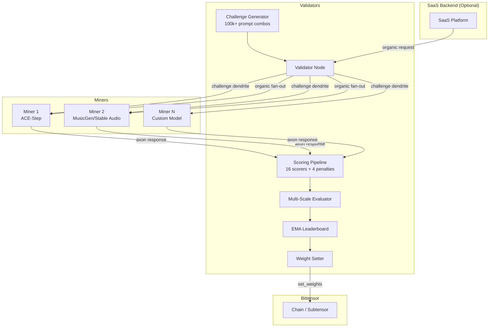
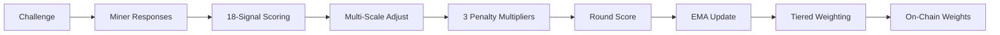

<div align="center">
  <picture>
    <source media="(prefers-color-scheme: dark)" srcset="assets/brand/banner-dark.png" />
    <source media="(prefers-color-scheme: light)" srcset="assets/brand/banner-light.png" />
    
  </picture>

  <p><strong>Decentralized AI Music Generation on Bittensor</strong></p>

  <a href="#"></a>
  <a href="LICENSE"></a>
  <a href="#"></a>
</div>

---

TuneForge is a Bittensor subnet that incentivizes decentralized AI music generation. Miners compete to produce high-quality audio from text prompts, scored by validators across **18 weighted quality scorers** and **4 penalty multipliers**. The subnet ships with MusicGen (default) and ACE-Step 1.5 as baseline starting models, but miners are encouraged to bring their own models, fine-tune existing ones, or integrate any text-to-music generation system. The scoring is model-agnostic -- it evaluates audio quality, not architecture. An EMA-based leaderboard translates performance into on-chain weight and TAO emissions.

**Testnet netuid: 234** | **Mainnet: TBD**

## Table of Contents

- [Architecture](#architecture)
- [Quick Start](#quick-start)
- [Scoring System](#scoring-system)
- [Reward Mechanism](#reward-mechanism)
- [Anti-Gaming](#anti-gaming)
- [Preference Model & Crowd Annotations](#preference-model--crowd-annotations)
- [Configuration Reference](#configuration-reference)
- [Project Structure](#project-structure)
- [Roadmap](#roadmap)
- [License](#license)

## Architecture



**Validators** generate text-to-music challenges, distribute them to miners via dendrite, score the returned audio across 18 quality signals with 4 penalty multipliers, apply multi-scale evaluation and genre-aware adjustments, maintain an EMA leaderboard with tiered power-law weighting, and submit weights on-chain.

**Miners** run a generation backend (MusicGen, ACE-Step 1.5, Stable Audio, or any custom model), receive challenges via axon, and return generated audio. Higher-quality, faster generation earns more weight and TAO. The baseline models are starting points -- miners who innovate with better models earn higher scores.

**Organic Generation** (optional) allows real user requests from the SaaS backend to flow through the validator. The validator fans out organic prompts to the top 10 miners by EMA, scores all responses with the same pipeline, updates the EMA leaderboard, and returns the best results to the customer. Organic and challenge scoring coexist on the same event loop and feed the same EMA.

## Quick Start

### Prerequisites

- Python 3.10 - 3.12
- NVIDIA GPU with CUDA support (miners)
- A registered Bittensor wallet with a hotkey on subnet 234 (testnet)

### Installation

```bash
git clone https://github.com/tuneforge-ai/tuneforge.git
cd tuneforge
pip install -e .
```

Or use the setup script:

```bash
bash scripts/setup.sh
```

### Download Models

```bash
bash scripts/download_models.sh
```

### Run a Miner

Copy the example config and edit it:

```bash
cp .env.miner.example .env
# Edit .env with your wallet, netuid, and GPU settings
```

Launch:

```bash
bash scripts/run_miner.sh
# Or directly:
python neurons/miner.py
```

See [docs/miner_setup.md](docs/miner_setup.md) for the complete miner guide including GPU requirements, model selection, and tuning parameters.

### Run a Validator

```bash
cp .env.validator.example .env
# Edit .env with your wallet and netuid
```

Launch:

```bash
bash scripts/run_validator.sh
# Or directly:
python neurons/validator.py
```

See [docs/validator_setup.md](docs/validator_setup.md) for the complete validator guide.

### Docker

```bash
# Miner (GPU)
docker build -f Dockerfile.miner -t tuneforge-miner .
docker run --gpus all --env-file .env tuneforge-miner

# Validator (CPU)
docker build -f Dockerfile.validator -t tuneforge-validator .
docker run --env-file .env tuneforge-validator
```

For the full architecture reference and SaaS layer setup, see [docs/setup.md](docs/setup.md).

## Scoring System

Every validation round, miners are scored across **16 weighted signals** grouped into five categories, with **4 penalty multipliers** applied to the final composite. Weights are consensus-critical constants hardcoded in `tuneforge/config/scoring_config.py` and must sum to 1.0.

### Scoring Signals

| Signal | Weight | Category |
|--------|--------|----------|
| **CLAP Adherence** | 19% | Prompt Adherence |
| **Attribute Verification** | 11% | Prompt Adherence |
| **Musicality** | 9% | Composition |
| **Melody Coherence** | 6% | Composition |
| **Structural Completeness** | 6% | Composition |
| **Vocal & Lyrics** | 8% | Naturalness & Mix |
| **Timbral Naturalness** | 3% | Naturalness & Mix |
| **Mix Separation** | 4% | Naturalness & Mix |
| **Learned MOS** | 3% | Naturalness & Mix |
| **Neural Quality (MERT)** | 5% | Production & Fidelity |
| **Production Quality** | 5% | Production & Fidelity |
| **Vocal Quality** | 4% | Production & Fidelity |
| **Audio Quality** | 2% | Production & Fidelity |
| **Preference Model** | 7% base (0% bootstrap, 2-20% trained) | Learned Preference |
| **Diversity** | 6% | Other |
| **Speed** | 2% | Other |

**CLAP Adherence** (19%) measures how well the generated audio matches the text prompt using `laion/larger_clap_music` text-audio cosine similarity, mapped from a floor of 0.15 to a ceiling of 0.75.

**Neural Quality** uses the MERT model (`m-a-p/MERT-v1-95M`) to evaluate temporal coherence, activation strength, layer agreement, and structural periodicity. **Musicality** analyzes pitch stability, harmonic progression, chord coherence, rhythmic groove, and arrangement sophistication. **Production Quality** checks spectral balance, frequency fullness, loudness consistency, dynamic expressiveness, and stereo quality.

**Vocal & Lyrics** uses Whisper-based lyrics intelligibility scoring alongside vocal clarity, pitch quality, and expressiveness. **Vocal Quality** evaluates vocal presence, clarity, pitch consistency, and harmonic richness. Both vocal scorers are **genre-aware**: instrumental genres (ambient, electronic, classical-cinematic) receive neutral 0.5 scores so that vocal absence doesn't penalize genuinely instrumental music. When the prompt explicitly requests vocals (`vocals_requested=True`), the genre gate is overridden and both vocal scorers evaluate the audio normally -- their weights are also boosted (2x for vocal/lyrics, 1.5x for vocal quality) and renormalized. **Timbral Naturalness** evaluates spectral envelope naturalness, harmonic decay, and transient quality. **Mix Separation** measures spectral clarity, frequency masking, spatial depth, and low-end/mid-range definition. **Learned MOS** provides multi-resolution perceptual quality estimation.

**Attribute Verification** checks prompt compliance (tempo, key, instruments) using librosa analysis and CLAP zero-shot classification. **Diversity** tracks CLAP embedding variety across a miner's recent 50 submissions with a population-level diversity bonus. **Speed** uses a duration-relative curve (see below).

**Preference Model** starts in bootstrap mode (returning neutral 0.5) and is progressively trained from crowd annotations via Bradley-Terry pairwise loss. Its weight auto-scales between 2% and 20% based on model validation accuracy.

### Penalties

Penalties are applied as multipliers on the final composite score, not as weighted components:

```
final_score = composite * duration_penalty * artifact_penalty * fad_penalty * fingerprint_penalty
```

| Penalty | Trigger | Effect |
|---------|---------|--------|
| **Silence** | Audio RMS below 0.01 | Hard zero (score = 0.0) |
| **Timeout** | Round-trip exceeds 300s | Hard zero (score = 0.0) |
| **Duration** | Audio duration off-target by >20% | Linear penalty (1.0 at 20% to 0.0 at 50%) |
| **Artifacts** | Spectral discontinuities, clipping, loops | Geometric mean of 4 checks (floor 0.1 each) |
| **FAD** | Per-miner Frechet Audio Distance divergence | Sigmoid penalty (floor 0.5) |
| **Fingerprint** | Chromaprint dedup + AcoustID known-song match | Multiplier (0.0 - 1.0) |

### Speed Scoring

Speed is scored using a **duration-relative curve** based on the ratio of generation time to requested duration:

- Ratio <= 1.0 (real-time or faster) = **1.0**
- Ratio = 3.0 = **0.3**
- Ratio >= 6.0 = **0.0**

This prevents penalizing longer music -- a 60-second track that takes 60 seconds to generate scores the same as a 10-second track generated in 10 seconds.

### Multi-Scale Evaluation

Scoring weights are automatically adjusted based on audio duration:

| Duration | Emphasis | Bonuses |
|----------|----------|---------|
| **Short** (< 10s) | Production quality, audio fidelity, timbral quality | None |
| **Medium** (10-30s) | Balanced (baseline weights) | None |
| **Long** (>= 30s) | Structure, melody, composition, vocals | Phrase coherence (+0.05), compositional arc (+0.05) |

Long-form submissions can earn up to +0.10 bonus for demonstrating phrase-level structure (verse-chorus patterns) and dynamic compositional arcs (rise-peak-fall energy contours).

### Genre-Aware Scoring

The scoring pipeline adjusts quality targets based on detected genre across 9 genre families (electronic, rock, classical-cinematic, ambient, hip-hop, jazz-blues, folk-acoustic, groove-soul, pop). Each family defines its own targets for dynamic range, onset density, rhythmic groove, spectral balance, loudness, and more.

## Reward Mechanism



### EMA Leaderboard

Each miner's long-term performance is tracked via an exponential moving average:

```
ema_new = 0.2 * round_score + 0.8 * ema_old
```

New miners start with EMA = 0.0 and build up from their first scored round. The EMA alpha of 0.2 balances responsiveness to recent performance with stability against outlier rounds. EMA state is persisted to disk every 5 blocks.

### Tiered Power-Law Weighting

Miners are ranked by EMA and split into two tiers for weight distribution:

- **Elite tier** (top 10 miners by EMA): share **80%** of total weight
- **Remaining miners**: share **20%** of total weight

Within each tier, weight is distributed proportionally to `ema ^ 2.0` (quadratic power-law). This creates a highly competitive landscape: breaking into the top 10 is a 4x weight multiplier, mirroring the organic query routing where only top-ranked miners receive real user requests. When fewer than 10 miners are active, all share 100% of the weight pool.

### Weight Submission

Weights are submitted on-chain every 115 blocks (`TF_WEIGHT_UPDATE_INTERVAL`). Validation rounds run every 300 seconds (`TF_VALIDATION_INTERVAL`), with 8 miners challenged per round (`TF_CHALLENGE_BATCH_SIZE`).

## Anti-Gaming

TuneForge employs multiple layered mechanisms to prevent miners from gaming the scoring system:

**Weight Perturbation.** Each round, scoring weights are perturbed by up to 30% (`TF_WEIGHT_PERTURBATION=0.30`), seeded deterministically by `SHA256(challenge_id + validator_secret)`. The validator secret (`TF_VALIDATOR_PERTURBATION_SECRET`) is a private nonce that is **never transmitted to miners**, making it impossible for miners to reconstruct the exact perturbed weights from open-source code.

**Scorer Dropout.** Each non-zero scorer has a 10% independent probability of being zeroed per round (`TF_SCORER_DROPOUT_RATE=0.10`), using the same secret-seeded RNG. This prevents miners from consistently exploiting any single scorer.

**FAD Penalty.** Per-miner Frechet Audio Distance measures how far a miner's output distribution diverges from real music statistics. Uses a sigmoid penalty curve with a floor of 0.5.

**Diversity Tracking.** CLAP embeddings of each miner's recent 50 outputs are tracked. Diversity scoring combines intra-miner variety (70%) with population-level diversity bonus (30%), encouraging both self-diversity and differentiation from other miners. The DiversityScorer shares the CLAP model instance with the main scorer to save ~600MB GPU memory.

**Fingerprint Detection.** Chromaprint audio fingerprinting detects duplicate submissions (same miner re-submitting identical audio). AcoustID lookup catches audio copied from known commercial recordings. Both apply as penalty multipliers on the final score.

**Hard Penalties.** Silence detection (RMS < 0.01), timeout enforcement (300s), payload validation (20MB max, 180s max duration), and artifact detection (clipping, spectral discontinuities, looping) act as binary or continuous multipliers that cannot be circumvented by high signal scores. Artifact detection uses a geometric mean of 4 checks (spectral discontinuity, clipping, repetition, spectral holes) with a 0.1 floor per check, so one marginal check doesn't zero the entire score.

**EMA Smoothing.** The alpha of 0.2 means a single exceptional round cannot dramatically change a miner's standing. Consistent quality over time is required.

## Preference Model & Crowd Annotations

The preference signal uses a trained MLP that predicts human preferences from CLAP embeddings (512-dim) or dual CLAP+MERT embeddings (1280-dim).

### Training Pipeline

1. **Annotation** -- A/B comparisons collected via the crowd annotation system with majority vote at quorum 5
2. **Embedding Cache** -- CLAP embeddings pre-computed for all annotated audio (`tools/build_embedding_cache.py`)
3. **Training** -- Bradley-Terry pairwise loss: `BCEWithLogitsLoss(logit_preferred - logit_rejected, target=1)` (`tools/train_preference.py`)
4. **Deployment** -- Checkpoint uploaded to DB; validator auto-loads hourly
5. **Auto-scaling** -- Weight scales linearly from 2% (accuracy 0.55) to 20% (accuracy 0.80)

In bootstrap mode (no trained checkpoint), the preference scorer returns a neutral 0.5 for all inputs and its weight is effectively zero.

### Quality Control

- **Gold standard tasks** with known answers validate annotator reliability
- **Annotator reliability tracking** per user with flagging for low-quality annotators
- **Active learning** selects uncertain/high-impact pairs for annotation priority

## Configuration Reference

All configuration is done through environment variables with the `TF_` prefix. Values can be set in a `.env` file or passed directly.

### Network

| Variable | Type | Default | Description |
|----------|------|---------|-------------|
| `TF_NETUID` | int | 0 | Subnet network UID |
| `TF_VERSION` | str | 1.0.0 | Protocol version |
| `TF_SUBTENSOR_NETWORK` | str | None | Network (finney, test, local) |
| `TF_SUBTENSOR_CHAIN_ENDPOINT` | str | None | Custom chain endpoint URL |

### Wallet

| Variable | Type | Default | Description |
|----------|------|---------|-------------|
| `TF_WALLET_NAME` | str | default | Wallet name |
| `TF_WALLET_HOTKEY` | str | default | Hotkey name |
| `TF_WALLET_PATH` | str | ~/.bittensor/wallets | Wallet path |

### Neuron

| Variable | Type | Default | Description |
|----------|------|---------|-------------|
| `TF_MODE` | str | miner | Runtime mode (miner/validator) |
| `TF_NEURON_EPOCH_LENGTH` | int | 100 | Blocks between weight updates |
| `TF_NEURON_TIMEOUT` | int | 120 | Forward timeout (seconds) |
| `TF_NEURON_AXON_OFF` | bool | false | Disable axon serving |
| `TF_AXON_PORT` | int | None | Axon port |

### Generation (Miner)

| Variable | Type | Default | Description |
|----------|------|---------|-------------|
| `TF_MODEL_NAME` | str | ace-step-1.5 | Music generation model (see [Model Selection](docs/miner_setup.md#model-selection-guide)) |
| `TF_GENERATION_MAX_DURATION` | int | 30 | Max generation duration (s) |
| `TF_GENERATION_SAMPLE_RATE` | int | 32000 | Audio sample rate (Hz) |
| `TF_GENERATION_TIMEOUT` | int | 120 | Generation timeout (s) |
| `TF_GPU_DEVICE` | str | cuda:0 | GPU device |
| `TF_MODEL_PRECISION` | str | float16 | Model precision (float32/float16/bfloat16) |
| `TF_GUIDANCE_SCALE` | float | 3.0 | Classifier-free guidance scale |
| `TF_TEMPERATURE` | float | 1.0 | Sampling temperature |
| `TF_TOP_K` | int | 250 | Top-K sampling |
| `TF_TOP_P` | float | 0.0 | Nucleus sampling (0 = disabled) |

### Validation

| Variable | Type | Default | Description |
|----------|------|---------|-------------|
| `TF_VALIDATION_INTERVAL` | int | 300 | Seconds between rounds |
| `TF_CHALLENGE_BATCH_SIZE` | int | 8 | Miners per round |
| `TF_MAX_CONCURRENT_VALIDATIONS` | int | 4 | Max concurrent scoring tasks |

### Consensus-Critical Constants (Hardcoded)

All scoring weights, thresholds, EMA parameters, and penalty curves are **hardcoded** in `tuneforge/config/scoring_config.py`. They are not configurable via environment variables. All validators must use identical values to maintain Bittensor consensus. Changing these values will cause your validator to diverge from network consensus.

See the [Scoring Signals](#scoring-signals) table for the full weight distribution, and the [Penalties](#penalties), [EMA Leaderboard](#ema-leaderboard), and [Anti-Gaming](#anti-gaming) sections for threshold details.

### Operational Parameters (Configurable)

| Variable | Type | Default | Description |
|----------|------|---------|-------------|
| `TF_VALIDATION_INTERVAL` | int | 300 | Seconds between rounds |
| `TF_WEIGHT_UPDATE_INTERVAL` | int | 115 | Blocks between weight sets |
| `TF_EMA_STATE_PATH` | str | ./ema_state.json | EMA persistence file path |
| `TF_EMA_SAVE_INTERVAL` | int | 5 | Blocks between EMA saves |
| `TF_FAD_REFERENCE_STATS_PATH` | str | ./reference_fad_stats.npz | FAD reference statistics file |
| `TF_PREFERENCE_MODEL_PATH` | str | None | Trained preference model checkpoint |
| `TF_VALIDATOR_PERTURBATION_SECRET` | str | auto | Private nonce for perturbation seed |

### API / Server

| Variable | Type | Default | Description |
|----------|------|---------|-------------|
| `TF_API_HOST` | str | 0.0.0.0 | API server host |
| `TF_API_PORT` | int | 8000 | API server port |
| `TF_STORAGE_PATH` | str | ./storage | Local storage path |
| `TF_FRONTEND_URL` | str | http://localhost:3000 | Frontend URL for CORS |

### Organic API (Validator)

| Variable | Type | Default | Description |
|----------|------|---------|-------------|
| `TF_ORGANIC_API_ENABLED` | bool | true | Enable organic generation API on validator |
| `TF_ORGANIC_API_PORT` | int | 8090 | Port for the validator's organic API |

### Logging / Monitoring

| Variable | Type | Default | Description |
|----------|------|---------|-------------|
| `TF_LOG_LEVEL` | str | INFO | Log level |
| `TF_LOG_DIR` | str | /tmp/tuneforge | Log directory |
| `TF_WANDB_ENABLED` | bool | false | Enable Weights & Biases logging |
| `TF_WANDB_ENTITY` | str | None | W&B entity |
| `TF_WANDB_PROJECT` | str | tuneforge | W&B project name |

## Project Structure

```
tuneforge/
├── assets/brand/                  -- Brand assets (banner, logomark)
├── docs/
│   ├── miner_setup.md             -- Complete miner guide
│   ├── validator_setup.md         -- Complete validator guide
│   └── setup.md                   -- Architecture and setup reference
├── neurons/
│   ├── miner.py                   -- Miner entry point
│   └── validator.py               -- Validator entry point
├── scripts/
│   ├── download_models.sh         -- Model download helper
│   ├── run_miner.sh               -- Miner launch script
│   ├── run_validator.sh           -- Validator launch script
│   └── setup.sh                   -- Environment setup
├── tests/                         -- Test suite (pytest, 436 tests)
├── tools/
│   ├── annotate_preferences.py    -- A/B preference annotation tool
│   ├── build_embedding_cache.py   -- CLAP embedding cache builder
│   ├── build_reference_stats.py   -- FAD reference statistics builder
│   ├── calibrate_mert.py          -- MERT calibration tool
│   ├── export_and_train.py        -- Annotation export + preference training
│   └── train_preference.py        -- Preference model training (Bradley-Terry)
├── tuneforge/
│   ├── __init__.py                -- Version, constants
│   ├── settings.py                -- Pydantic settings (TF_ env vars)
│   ├── subnet_api.py              -- Subnet API interface
│   ├── api/
│   │   ├── models.py              -- API data models
│   │   ├── organic_router.py      -- Organic generation router
│   │   ├── server.py              -- SaaS platform FastAPI application
│   │   ├── validator_api.py       -- Organic API (runs inside validator)
│   │   └── routes/                -- API route handlers (generate, health)
│   ├── base/
│   │   ├── neuron.py              -- Base neuron class
│   │   ├── miner.py               -- Base miner neuron
│   │   ├── validator.py           -- Base validator neuron
│   │   ├── protocol.py            -- Synapse definitions
│   │   └── dendrite.py            -- Dendrite response tracking
│   ├── config/
│   │   └── scoring_config.py      -- All scoring weights and thresholds
│   ├── core/
│   │   ├── miner.py               -- TuneForgeMiner implementation
│   │   └── validator.py           -- TuneForgeValidator implementation
│   ├── generation/
│   │   ├── model_manager.py       -- Backend manager (lazy loading, GPU monitoring)
│   │   ├── musicgen_backend.py    -- MusicGen generation backend
│   │   ├── ace_step_backend.py     -- ACE-Step 1.5 backend (default)
│   │   ├── stable_audio_backend.py -- Stable Audio backend
│   │   ├── audio_utils.py         -- Audio normalization, encoding, fades
│   │   └── prompt_parser.py       -- Natural language prompt builder
│   ├── rewards/
│   │   ├── reward.py              -- ProductionRewardModel (composite scoring)
│   │   ├── leaderboard.py         -- EMA leaderboard with tiered power-law weighting
│   │   ├── weight_setter.py       -- On-chain weight submission
│   │   └── scoring.py             -- Task-level scorer
│   ├── scoring/
│   │   ├── clap_scorer.py         -- CLAP text-audio similarity
│   │   ├── musicality.py          -- Pitch, harmony, rhythm, arrangement
│   │   ├── neural_quality.py      -- MERT learned representations
│   │   ├── production_quality.py  -- Spectral balance, LUFS, dynamics
│   │   ├── melody_coherence.py    -- Melodic intervals, contour, memorability
│   │   ├── structural_completeness.py -- Section detection, form, transitions
│   │   ├── audio_quality.py       -- Signal-level analysis
│   │   ├── preference_model.py    -- Preference MLP (single/dual) + auto-scaler
│   │   ├── vocal_quality.py       -- Vocal clarity, pitch
│   │   ├── vocal_lyrics.py        -- Whisper-based lyrics intelligibility
│   │   ├── timbral_naturalness.py -- Spectral envelope, harmonic decay, transients
│   │   ├── mix_separation.py      -- Spectral clarity, frequency masking, spatial depth
│   │   ├── learned_mos.py         -- Multi-resolution perceptual quality
│   │   ├── perceptual_quality.py  -- Spectral MOS estimation
│   │   ├── neural_codec_quality.py -- EnCodec reconstruction quality
│   │   ├── diversity.py           -- CLAP embedding diversity (shared CLAP)
│   │   ├── attribute_verifier.py  -- Prompt compliance (tempo, key, instruments)
│   │   ├── fad_scorer.py          -- Frechet Audio Distance (per-miner)
│   │   ├── artifact_detector.py   -- Clipping, loops, discontinuity
│   │   ├── stereo_quality.py      -- Stereo imaging metrics
│   │   ├── chord_coherence.py     -- Harmonic structure analysis
│   │   ├── harmonic_quality.py    -- Vocal/formant characteristics
│   │   ├── genre_profiles.py      -- Genre-aware quality targets (9 families)
│   │   ├── multi_scale.py         -- Duration-based weight adjustment + bonuses
│   │   ├── conditional_targets.py -- Prompt-derived quality targets
│   │   ├── progressive_difficulty.py -- Network quality EMA -> difficulty
│   │   ├── active_learner.py      -- Active learning for annotation pairs
│   │   └── annotator_reliability.py -- Annotator quality tracking
│   ├── utils/
│   │   ├── logging.py             -- Loguru setup
│   │   ├── config.py              -- Env file loading
│   │   └── weight_utils.py        -- Weight processing helpers
│   └── validation/
│       ├── prompt_generator.py    -- Challenge prompt generation (100k+ combos)
│       └── challenge_manager.py   -- Challenge tracking
├── docker-compose.yml             -- Docker services
├── Dockerfile.miner               -- Miner container (NVIDIA CUDA)
├── Dockerfile.validator           -- Validator container (CPU-only)
├── ecosystem.config.js            -- PM2 process manager config
├── pyproject.toml                 -- Project metadata and dependencies
├── .env.miner.example             -- Miner config template
└── .env.validator.example         -- Validator config template
```

## Roadmap

- **Mainnet deployment** -- currently running on testnet (netuid 234); mainnet launch pending stability milestones
- **Preference model maturation** -- the crowd annotation pipeline is live; as more annotations accumulate, the preference model weight auto-scales from 2% toward 20%, progressively shifting scoring toward human-validated quality
- **Additional generation backends** -- MusicGen and ACE-Step 1.5 serve as baselines; miners are encouraged to integrate new models as they emerge
- **Vocal generation support** -- the scoring pipeline includes vocal quality (4%) and vocal/lyrics (8%) scorers; dedicated vocal generation backends are planned
- **Progressive difficulty** -- the progressive difficulty system scales challenge complexity as network quality improves, pushing miners toward longer and higher-quality generations over time

## License

This project is licensed under [CC BY-NC 4.0](LICENSE) (Creative Commons Attribution-NonCommercial 4.0 International).
