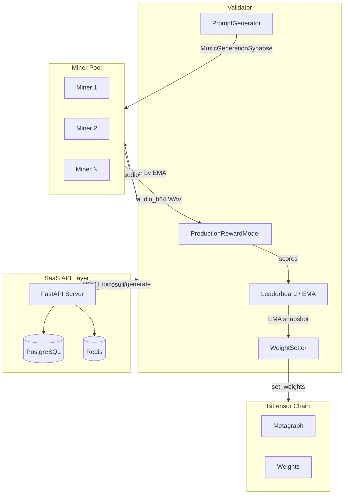
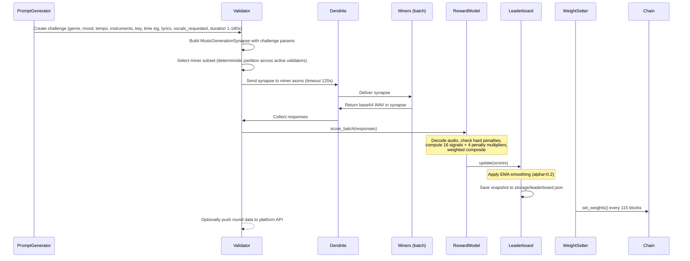
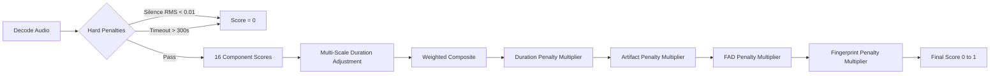
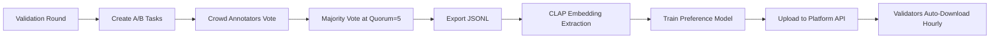

# TuneForge Setup Guide

Complete reference for deploying and operating the TuneForge music generation subnet on Bittensor. This document covers system architecture, protocol definitions, deployment methods, environment configuration, scoring internals, and development workflow.

---

## Table of Contents

1. [Architecture Overview](#architecture-overview)
2. [Epoch and Round Structure](#epoch-and-round-structure)
3. [Organic Generation Flow](#organic-generation-flow)
4. [Scoring Pipeline](#scoring-pipeline)
5. [Protocol Definitions](#protocol-definitions)
6. [Prerequisites](#prerequisites)
7. [Installation](#installation)
8. [Network Configuration](#network-configuration)
9. [Deployment: Docker](#deployment-docker)
10. [Deployment: PM2](#deployment-pm2)
11. [Environment Variable Reference](#environment-variable-reference)
12. [Database and Persistence](#database-and-persistence)
13. [Security Model](#security-model)
14. [Annotation System](#annotation-system)
15. [Development](#development)

---

## Architecture Overview

TuneForge is a Bittensor subnet for AI music generation. Validators issue challenges to miners, score the returned audio across 16 dimensions with 4 penalty multipliers, maintain an EMA leaderboard, and set on-chain weights. The validator also serves an organic generation API (port 8090) that the SaaS backend calls for real-time music generation. An optional SaaS API layer provides user authentication and a credit system.



---

## Epoch and Round Structure

The validation loop is organized into epochs. Each epoch contains a fixed sequence of phases:

```
Epoch (1080s / ~18 min):
  [1] Commit-reveal sync     60s   (EPOCH_SYNC)
  [2] Round 1               240s   (DEFAULT_ROUND_INTERVAL)
  [3] Round 2               240s
  [4] Round 3               240s
  [5] Round 4               240s
  [6] Cooldown              120s   (EPOCH_COOLDOWN)
```

Key constants (defined in `tuneforge/__init__.py`):

| Constant | Value | Description |
|----------|-------|-------------|
| `MAX_ROUNDS_PER_EPOCH` | 4 | Rounds per epoch |
| `DEFAULT_ROUND_INTERVAL` | 240s | Time between rounds |
| `EPOCH_SYNC` | 60s | Commit-reveal and blockchain finality at epoch start |
| `EPOCH_COOLDOWN` | 60s | Sync buffer at epoch end |
| `DEFAULT_EPOCH_INTERVAL` | 1080s (~18 min) | 60 + 4 x 240 + 60 |
| `DEFAULT_WEIGHT_UPDATE_INTERVAL` | 115 blocks | Frequency of on-chain weight submissions |



Step-by-step:

1. **PromptGenerator** creates a challenge with genre, mood, tempo, instruments, key signature, time signature, lyrics, vocals_requested, creative constraint, and duration (1--180 seconds).
2. Validator constructs a `MusicGenerationSynapse` populated with the challenge parameters.
3. Validator receives its miner subset (deterministically partitioned across active validators via commit-sync).
4. Dendrite sends the synapse to miner axons with a timeout of 120 seconds.
5. Miners generate audio and return base64-encoded WAV data in the synapse response.
6. `ProductionRewardModel.score_batch()` scores all responses (see [Scoring Pipeline](#scoring-pipeline)).
7. `Leaderboard.update()` applies EMA smoothing to the raw scores.
8. The leaderboard snapshot is persisted to `storage/leaderboard.json`.
9. `WeightSetter.set_weights()` submits on-chain weights every 115 blocks.
10. Optionally, the validator pushes round data to the platform API for the SaaS layer.

---

## Organic Generation Flow

Organic requests from the SaaS backend flow through the validator's built-in HTTP API (port 8090):

```
SaaS Backend -> POST /organic/generate -> Validator
Validator -> select one miner by EMA (weighted, with MIN_EMA_THRESHOLD=0.45, 120s timeout)
Validator -> on failure, fall back to next-best miner
Validator -> return result to SaaS Backend
```

Organic requests do **not** affect miner scores or weights. The challenge pipeline is the sole quality signal. The organic router selects a single miner per request (no fan-out) to avoid wasting compute, load-balancing across qualifying miners weighted by EMA score. Only miners with EMA >= 0.45 are eligible for organic traffic.

The validator runs the organic API server and the challenge loop concurrently on the same asyncio event loop. Scoring models are protected by a lock, and CPU-bound scoring runs in a thread pool executor so organic requests are not blocked by rounds.

---

## Scoring Pipeline

Each miner response passes through the full scoring pipeline within `ProductionRewardModel.score_batch()`.



### Hard Penalties

Any of the following results in an immediate score of 0:

| Condition | Threshold |
|-----------|-----------|
| Silence | RMS < 0.01 |
| Timeout | > 300 seconds |

### Scoring Components (16 Scorers)

All weights are **hardcoded** in `scoring_config.py` for validator consensus. They are NOT configurable via environment variables. Weights sum to 1.0.

| Component | Weight | Model / Method | Description |
|-----------|--------|----------------|-------------|
| `clap` | 0.19 | `laion/clap-htsat-fused` | CLAP text-audio cosine similarity (prompt adherence). Raw similarity in [0.05, 0.45] mapped to [0, 1]. |
| `attribute` | 0.11 | Rule-based | Attribute verification (genre, mood, tempo, key, instruments) |
| `musicality` | 0.09 | Librosa analysis | Rhythmic and harmonic analysis with one-sided minimum floor |
| `vocal_lyrics` | 0.08 | Whisper | Lyrics intelligibility, vocal clarity, pitch accuracy |
| `preference` | 0.07 | PreferenceHead / DualPreferenceHead | Learned preference model. 0% at bootstrap, auto-scales 2--20% based on validation accuracy. Bradley-Terry pairwise loss. |
| `melody` | 0.06 | Melodic contour analysis | Melodic coherence and development with one-sided minimum floor |
| `structural` | 0.06 | Section detection | Structural completeness (intro, development, outro) with one-sided minimum floor |
| `diversity` | 0.06 | Embedding cache (50 entries) | Output diversity across rounds + population-level diversity bonus |
| `production` | 0.05 | Spectral analysis | Production quality (mixing, mastering characteristics) |
| `neural_quality` | 0.05 | `m-a-p/MERT-v1-95M` | MERT-based neural audio quality assessment |
| `vocal` | 0.04 | Vocal detection + analysis | Vocal quality when vocals are present |
| `mix_separation` | 0.04 | Frequency analysis | Spectral clarity, frequency masking, spatial depth |
| `timbral` | 0.03 | Spectral envelope analysis | Spectral envelope, harmonic decay, transient analysis |
| `learned_mos` | 0.03 | Multi-resolution CNN | Multi-resolution perceptual quality estimation |
| `quality` | 0.02 | Classic DSP metrics | Classic audio quality sub-metrics (see below) |
| `speed` | 0.02 | `dendrite.process_time` | Duration-relative generation speed (see below) |

### Audio Quality Sub-Weights

The `quality` component is a weighted sum of five sub-metrics (also hardcoded):

| Sub-Metric | Weight |
|------------|--------|
| Harmonic ratio | 0.25 |
| Onset quality | 0.20 |
| Spectral contrast | 0.20 |
| Temporal variation | 0.20 |
| Dynamic range | 0.15 |

### Speed Scoring

Speed uses a **duration-relative ratio** (generation_time / requested_duration), NOT absolute thresholds:

| Ratio (gen_time / duration) | Score |
|-----------------------------|-------|
| <= 1.0 | 1.0 |
| 3.0 | 0.3 |
| >= 6.0 | 0.0 |

Speed is measured using the validator-side `dendrite.process_time`, not miner-reported `generation_time_ms`.

### 4 Penalty Multipliers

Penalties are applied multiplicatively to the weighted composite score:

```
final = composite * duration_penalty * artifact_penalty * fad_penalty * fingerprint_penalty
```

| Penalty | Formula |
|---------|---------|
| **Duration** | +/-20% tolerance = 1.0, linear decay to 0.0 at +/-50% deviation |
| **Artifact** | Detects clipping, loops, discontinuities. Multiplier range 0--1. |
| **FAD** | Sigmoid curve: midpoint=15, steepness=2, floor=0.5 |
| **Fingerprint** | AcoustID known-song match. Multiplier 0.0--1.0 based on match score (threshold 0.80). |

### Anti-Gaming Measures

All scoring parameters are **hardcoded for consensus** -- miners cannot reconstruct exact weights from the open-source code alone.

- **No configurable weight env vars:** All weights and thresholds are constants in `scoring_config.py`.

### Multi-Scale Duration Adjustment

Scoring weights are adjusted based on audio duration:

| Duration | Adjustments |
|----------|-------------|
| Short (< 10s) | Increased weight for production, quality, timbral |
| Medium (10--30s) | Baseline weights (no adjustment) |
| Long (>= 30s) | structural x1.8, melody x1.5, phrase completion bonus +0.05, arc bonus +0.05 |

### Genre Profiles

9 genre families with per-genre weight adjustments. Vocal gate with `vocals_requested` override -- when the synapse requests vocals, vocal-related scorers are activated regardless of genre profile defaults.

### Leaderboard EMA and Tiered Weighting

Raw round scores are smoothed with exponential moving average:

- **Alpha:** 0.2
- **Seed value:** 0.0 (new miners start from zero)
- **Tiered distribution:** Top 10 miners share 80% of weight, rest share 20%
- **Within-tier formula:** `ema ^ 2.0` (quadratic power-law)
- **Elite K:** 10, **Elite Pool:** 0.80

### Preference Model

- `PreferenceHead` (512-dim) or `DualPreferenceHead` (1280-dim)
- Bradley-Terry pairwise loss for training
- Auto-scaling: 0% contribution at bootstrap, 2--20% based on validation accuracy
- Validators auto-download updated models hourly from the platform API

### Constants

| Constant | Value |
|----------|-------|
| MAX_DURATION | 180 seconds |
| CLAP_SIM_CEILING | 0.75 |
| CLAP_SIM_FLOOR | 0.15 |
| Silence threshold (RMS) | 0.01 |
| Timeout | 300 seconds |
| Diversity history | 50 entries |

---

## Protocol Definitions

All synapse classes are defined in `tuneforge/base/protocol.py`.

### MusicGenerationSynapse

**Request fields** (validator to miner):

| Field | Type | Default | Description |
|-------|------|---------|-------------|
| `prompt` | `str` | `""` | Text prompt describing desired music |
| `genre` | `str` | `""` | Target genre |
| `mood` | `str` | `""` | Target mood |
| `tempo_bpm` | `int` | `120` | Desired BPM (20--300) |
| `duration_seconds` | `float` | `10.0` | Desired duration in seconds (1--180) |
| `key_signature` | `str | None` | `None` | Musical key signature |
| `time_signature` | `str | None` | `None` | Time signature |
| `instruments` | `list[str] | None` | `None` | Preferred instruments |
| `reference_audio` | `str | None` | `None` | Base64-encoded reference audio |
| `seed` | `int | None` | `None` | Random seed for reproducibility |
| `challenge_id` | `str` | `""` | Unique challenge ID |
| `lyrics` | `str | None` | `None` | Lyrics text for vocal generation |
| `vocals_requested` | `bool` | `False` | Whether vocals are requested |
| `is_organic` | `bool` | `False` | Organic request vs validator challenge |

**Response fields** (miner to validator):

| Field | Type | Default | Description |
|-------|------|---------|-------------|
| `audio_b64` | `str | None` | `None` | Base64-encoded WAV audio |
| `sample_rate` | `int | None` | `None` | Sample rate in Hz |
| `generation_time_ms` | `int | None` | `None` | Generation time in milliseconds |
| `model_id` | `str | None` | `None` | Model identifier string |

**Hash fields:** `prompt`, `genre`, `mood`, `tempo_bpm`, `duration_seconds`, `challenge_id`

### PingSynapse

Used by validators to discover online miners and their capabilities before sending challenges.

**Request field:**

| Field | Type | Description |
|-------|------|-------------|
| `version_check` | `str | None` | Validator protocol version for compatibility check |

**Response fields:**

| Field | Type | Description |
|-------|------|-------------|
| `is_available` | `bool` | Whether the miner is available for generation requests |
| `supported_genres` | `list[str]` | Genres the miner's model supports |
| `supported_durations` | `list[float]` | Supported generation durations in seconds |
| `gpu_model` | `str` | GPU model name |
| `max_concurrent` | `int` | Maximum concurrent generation requests |
| `version` | `str` | Miner software version |

### HealthReportSynapse

Validators collect these metrics to monitor miner health and reliability.

| Field | Type | Description |
|-------|------|-------------|
| `gpu_utilization` | `float` | GPU utilization percentage (0--100) |
| `gpu_memory_used_mb` | `float` | GPU memory used in MB |
| `cpu_percent` | `float` | CPU utilization percentage (0--100) |
| `memory_percent` | `float` | System memory utilization percentage (0--100) |
| `generations_completed` | `int` | Total generations completed since startup |
| `average_generation_time_ms` | `float` | Rolling average generation time in ms |
| `uptime_seconds` | `float` | Miner uptime in seconds |
| `errors_last_hour` | `int` | Errors encountered in the last hour |

---

## Prerequisites

### Hardware

**Miner (GPU required):**

- NVIDIA GPU with at least 16 GB VRAM (A100 40GB recommended)
- 32 GB system RAM minimum
- 100 GB SSD storage
- CUDA 12.1+ and NVIDIA drivers installed

**Validator (CPU-only):**

- 8+ CPU cores
- 16 GB system RAM minimum
- 50 GB SSD storage
- No GPU required (scoring models run on CPU)

### Software

- Python 3.10 or 3.11
- pip and venv
- ffmpeg and libsndfile1
- Git
- Docker and Docker Compose (for containerized deployment)
- PM2 and Node.js (for process-managed deployment)
- A registered Bittensor wallet with hotkey

---

## Installation

### 1. Clone the repository

```bash
git clone https://github.com/tuneforge-ai/tuneforge.git
cd tuneforge
```

### 2. Create and activate a virtual environment

```bash
python3.11 -m venv venv
source venv/bin/activate
```

### 3. Install system dependencies

```bash
sudo apt-get update && sudo apt-get install -y ffmpeg libsndfile1 git curl
```

### 4. Install Python dependencies

```bash
pip install -r requirements.txt
pip install -e .
```

### 5. Create a Bittensor wallet (if you do not have one)

```bash
btcli wallet create --wallet.name my-wallet
btcli wallet new_hotkey --wallet.name my-wallet --wallet.hotkey my-hotkey
```

### 6. Register on the subnet

**Testnet (netuid 234):**

```bash
btcli subnet register --wallet.name my-wallet --wallet.hotkey my-hotkey --netuid 234 --subtensor.network test
```

### 7. Configure environment

Copy the example environment file and edit it:

```bash
cp .env.miner.example .env.miner    # For miners
cp .env.validator.example .env.validator  # For validators
```

All environment variables use the `TF_` prefix. See the [Environment Variable Reference](#environment-variable-reference) section for the complete list.

---

## Network Configuration

| Parameter | Testnet | Mainnet |
|-----------|---------|---------|
| Netuid | 234 | TBD |
| Subtensor network | `test` | `finney` |
| Miner axon port | Configurable (`TF_AXON_PORT`), example: 8091 | Same |
| Validator axon port | Example: 8092 | Same |
| API server port | 8000 (`TF_API_PORT`) | Same |
| Organic API port | 8090 (`TF_ORGANIC_API_PORT`) | Same |
| Subtensor endpoint | Configurable via `TF_SUBTENSOR_CHAIN_ENDPOINT` | Same |

---

## Deployment: Docker

The `docker-compose.yml` defines five services. Use whichever subset matches your role.

### Services

| Service | Image / Dockerfile | Port Mapping | GPU | Depends On |
|---------|--------------------|--------------|-----|------------|
| `miner` | `Dockerfile.miner` (NVIDIA CUDA 12.1.1) | 8091, 8000 | Yes (1x NVIDIA) | -- |
| `validator` | `Dockerfile.validator` (python:3.11-slim) | 8092 | No | -- |
| `api` | `Dockerfile.miner` (runs uvicorn) | 8080 -> 8000 | Yes (1x NVIDIA) | postgres, redis |
| `postgres` | `postgres:16-alpine` | 5432 | No | -- |
| `redis` | `redis:7-alpine` (maxmemory 256mb, allkeys-lru) | 6379 | No | -- |

### Volumes

- `./storage:/app/storage` -- leaderboard snapshots and audio files
- `~/.bittensor/wallets:/root/.bittensor/wallets:ro` -- wallet access (read-only)
- `pgdata` -- PostgreSQL persistent data

### Commands

```bash
# Miner only
docker compose up miner -d

# Validator only
docker compose up validator -d

# Full stack (miner + validator + API + postgres + redis)
docker compose up -d

# View logs
docker compose logs -f miner
docker compose logs -f validator

# Stop everything
docker compose down
```

Environment files are loaded via `env_file` directives: `.env.miner` for the miner and api services, `.env.validator` for the validator service.

The miner Dockerfile pre-downloads the MusicGen Medium model at build time. For other backends (DiffRhythm), pre-download weights before starting — see `docs/miner_setup.md` for instructions. The validator Dockerfile pre-downloads the `laion/clap-htsat-fused` CLAP model. This avoids download delays at first startup.

---

## Deployment: PM2

The `ecosystem.config.js` defines five PM2 processes. All use `autorestart: true`, `max_restarts: 10`, and configurable restart delays.

### Processes

| Process Name | Script | Restart Delay | Notes |
|--------------|--------|---------------|-------|
| `tuneforge-miner-1` | `neurons.miner --env-file .env.miner` | 5000 ms | `PYTHONUNBUFFERED=1` |
| `tuneforge-miner-2` | `neurons.miner --env-file .env.miner2` | 5000 ms | `PYTHONUNBUFFERED=1`, second miner instance |
| `tuneforge-validator` | `neurons.validator --env-file .env.validator` | 5000 ms | `CUDA_VISIBLE_DEVICES=-1` (CPU-only) |
| `tuneforge-api` | `uvicorn tuneforge.api.server:app --host 0.0.0.0 --port 8000` | 3000 ms | Requires `TF_DB_URL`, `TF_JWT_SECRET`, etc. |
| `tuneforge-web` | `npm run dev` (in `/home/borgg/tuneforge-web`) | 3000 ms | Next.js frontend |

### Commands

```bash
# Start all processes
pm2 start ecosystem.config.js

# Check status
pm2 status

# View logs (all or specific)
pm2 logs
pm2 logs tuneforge-miner-1

# Restart a specific process
pm2 restart tuneforge-validator

# Stop all
pm2 stop all

# Delete all managed processes
pm2 delete all
```

---

## Environment Variable Reference

All variables use the `TF_` prefix and are loaded via `pydantic-settings`.

**Important:** All scoring weights, thresholds, penalty parameters, EMA constants, speed curves, and CLAP/MERT model parameters are **hardcoded constants** in `tuneforge/config/scoring_config.py`. They are NOT configurable via environment variables. This is by design -- all validators must use identical scoring parameters for consensus. See the [Scoring Pipeline](#scoring-pipeline) section for the full list of hardcoded values.

The environment variables below control only **operational** parameters.

### Network

| Variable | Type | Default | Description |
|----------|------|---------|-------------|
| `TF_NETUID` | int | `0` | Subnet network UID |
| `TF_VERSION` | str | `1.0.0` | Software version |
| `TF_SUBTENSOR_NETWORK` | str | `None` | Subtensor network (finney, test, local) |
| `TF_SUBTENSOR_CHAIN_ENDPOINT` | str | `None` | Custom chain endpoint URL |
| `TF_BURN_UID` | int | `0` | UID to burn weight to |
| `TF_BURN_WEIGHT` | float | `0.0` | Weight fraction to burn |

### Wallet

| Variable | Type | Default | Description |
|----------|------|---------|-------------|
| `TF_WALLET_NAME` | str | `default` | Wallet coldkey name |
| `TF_WALLET_HOTKEY` | str | `default` | Hotkey name |
| `TF_WALLET_PATH` | str | `~/.bittensor/wallets` | Wallet directory path |

### Neuron

| Variable | Type | Default | Description |
|----------|------|---------|-------------|
| `TF_MODE` | str | `miner` | Runtime mode: `miner` or `validator` |
| `TF_NEURON_EPOCH_LENGTH` | int | `100` | Blocks between weight updates |
| `TF_NEURON_TIMEOUT` | int | `120` | Forward timeout in seconds |
| `TF_NEURON_AXON_OFF` | bool | `false` | Disable axon serving |
| `TF_AXON_PORT` | int | `None` | Axon port for serving requests |

### Generation (Miner)

| Variable | Type | Default | Description |
|----------|------|---------|-------------|
| `TF_MODEL_NAME` | str | `facebook/musicgen-large` | Music generation model (`facebook/musicgen-large`, `diffrhythm-full`, `heartmula`, `heartmula-7b`) |
| `TF_GENERATION_MAX_DURATION` | int | `30` | Maximum generation duration (seconds) |
| `TF_GENERATION_SAMPLE_RATE` | int | `32000` | Audio sample rate in Hz |
| `TF_GENERATION_TIMEOUT` | int | `120` | Miner-side timeout for generation requests (seconds) |
| `TF_GPU_DEVICE` | str | `cuda:0` | GPU device for model inference |
| `TF_MODEL_PRECISION` | str | `float16` | Model precision: float32, float16, bfloat16 |
| `TF_GUIDANCE_SCALE` | float | `3.0` | Classifier-free guidance scale |
| `TF_TEMPERATURE` | float | `1.0` | Sampling temperature |
| `TF_TOP_K` | int | `250` | Top-K sampling (0 = disabled) |
| `TF_TOP_P` | float | `0.0` | Nucleus sampling (0 = disabled) |

### Operational (Validator)

| Variable | Type | Default | Description |
|----------|------|---------|-------------|
| `TF_ROUND_INTERVAL` | int | `240` | Seconds between validation rounds |
| `TF_EPOCH_INTERVAL` | int | `1080` | Seconds per epoch (sync + rounds + cooldown) |
| `TF_WEIGHT_UPDATE_INTERVAL` | int | `115` | Blocks between on-chain weight submissions |
| `TF_METAGRAPH_SYNC_INTERVAL` | int | `1200` | Seconds between metagraph syncs |
| `TF_EMA_STATE_PATH` | str | `./ema_state.json` | Path to persist EMA state across restarts |
| `TF_EMA_SAVE_INTERVAL` | int | `5` | Rounds between EMA state saves |
| `TF_PREFERENCE_MODEL_PATH` | str | `None` | Path to trained PreferenceHead checkpoint (.pt) |
| `TF_FAD_REFERENCE_STATS_PATH` | str | `./reference_fad_stats.npz` | Path to FAD reference statistics |
| `TF_ACOUSTID_API_KEY` | str | `""` | AcoustID API key for fingerprint penalty (optional) |

### API / Server

| Variable | Type | Default | Description |
|----------|------|---------|-------------|
| `TF_API_HOST` | str | `0.0.0.0` | API server bind host |
| `TF_API_PORT` | int | `8000` | API server port |
| `TF_API_MAX_QUEUE_SIZE` | int | `100` | Max pending API requests |
| `TF_STORAGE_PATH` | str | `./storage` | Local storage path for snapshots and audio |
| `TF_FRONTEND_URL` | str | `http://localhost:3000` | Frontend URL (used for CORS) |
| `TF_VALIDATOR_API_URL` | str | `""` | Platform API base URL for validator data push |
| `TF_VALIDATOR_API_TOKEN` | str | `""` | Bearer token for validator-to-API authentication |
| `TF_ORGANIC_API_ENABLED` | bool | `true` | Enable organic generation API on validator |
| `TF_ORGANIC_API_PORT` | int | `8090` | Port for the validator's organic API |

### Logging

| Variable | Type | Default | Description |
|----------|------|---------|-------------|
| `TF_LOG_LEVEL` | str | `INFO` | Log level (DEBUG, INFO, WARNING, ERROR) |
| `TF_LOG_DIR` | str | `/tmp/tuneforge` | Directory for log files |

---

## Database and Persistence

TuneForge uses different storage backends depending on the component:

| Component | Backend | Location |
|-----------|---------|----------|
| Miner leaderboard (EMA scores) | In-memory, JSON snapshot | `storage/leaderboard.json` |
| EMA state | JSON (configurable path) | `TF_EMA_STATE_PATH` |
| SaaS user accounts, credits, API keys | PostgreSQL (asyncpg) | Configured via `TF_DB_URL` |
| Rate limiting, SSE pub/sub | Redis | Default port 6379 |
| Audio files | Local filesystem (fallback) or platform API | `storage/` directory |
| FAD reference statistics | NumPy archive | `TF_FAD_REFERENCE_STATS_PATH` |
| Preference model checkpoint | PyTorch .pt file | `TF_PREFERENCE_MODEL_PATH` |

### PostgreSQL Schema

Managed by Alembic async migrations in `alembic/`. Key tables include:

- `users` -- user accounts
- `api_keys` -- long-lived API keys
- `credits` -- credit balances and daily resets (50/day free, 5 per generation)
- `generations` -- generation request records
- `validation_rounds` -- validator round data
- `annotation_tasks` -- A/B comparison task definitions (quorum=5)
- `annotations` -- individual user votes
- `preference_models` -- trained model metadata with SHA256 checksums and validation accuracy
- `annotator_reliability` -- per-annotator accuracy tracking
- `annotation_milestones` -- annotator achievement tracking
- `annotation_streaks` -- annotator streak tracking

### Running Migrations

```bash
# Apply all pending migrations
alembic upgrade head

# Generate a new migration after model changes
alembic revision --autogenerate -m "describe change"
```

---

## Security Model

### Validator Stake Filtering

Miners verify the caller's stake before accepting generation requests. The minimum required stake is 1000.0 α (`MIN_GENERATION_STAKE`). This prevents unauthorized nodes from extracting generations.

### Hotkey Authentication

Validators sign API requests using the `HotkeyAuth` class, which signs a payload consisting of `nonce.hotkey.method.path.bodyhash`. This provides cryptographic proof of validator identity.

### Bearer Token Fallback

For development environments, bearer token authentication is available as an alternative to hotkey signing.

### Speed Scoring Integrity

Speed scores use the validator-measured round-trip time (`dendrite.process_time`), not the miner-reported `generation_time_ms`. This prevents miners from falsifying their generation speed.

### SaaS API Authentication

The API layer supports three authentication modes:

1. **JWT authentication** -- access tokens (15 min) and refresh tokens (7 days) for user sessions.
2. **API key authentication** -- long-lived keys for programmatic access.
3. **Legacy environment variable authentication** -- for backward compatibility.

### Validator-to-API Service Token

Validators push data to the platform API using a service token (`TF_VALIDATOR_API_TOKEN`), verified by the `require_validator_token` dependency.

---

## Annotation System

TuneForge includes a crowd annotation system for training preference models via A/B comparisons.

### Pipeline



### Key Details

- **Task creation:** A/B comparison tasks are generated from validation round outputs.
- **Voting:** Each user can vote once per task (`UNIQUE(task_id, user_id)`).
- **Aggregation:** Majority vote at quorum (default 5 annotators). Ties are discarded.
- **Active learning:** `active_learner.py` selects maximally informative pairs for annotation.
- **Annotator reliability:** `annotator_reliability.py` tracks per-annotator accuracy and weights votes accordingly.
- **Export:** `GET /annotations/export` returns JSONL format compatible with `train_preference.py`.
- **Training:** `tools/export_and_train.py` handles export, CLAP embedding extraction, Bradley-Terry pairwise training, and model upload.
- **Auto-update:** Validators check `GET /annotations/model/latest` once per hour and download if the SHA256 has changed.

### Database Tables

- `annotation_tasks` -- A/B comparison task definitions
- `annotations` -- individual user votes
- `preference_models` -- trained model metadata, SHA256 checksums, validation accuracy
- `annotator_reliability` -- per-annotator accuracy and weight
- `annotation_milestones` -- annotator achievement records
- `annotation_streaks` -- annotator streak tracking

### API Endpoints

Eight endpoints under `/annotations/`: task listing, voting, statistics, export, and model upload/download. See `tuneforge/api/routes/annotations.py`.

---

## Development

### Running Tests

```bash
pytest tests/
```

Tests use `pytest-asyncio` in auto mode. Coverage reporting is available via `pytest-cov`.

### Adding a New Scorer

1. Create a new class in `tuneforge/scoring/` (see existing scorers for the interface pattern).
2. Register it in `ProductionRewardModel` (the batch scoring orchestrator in `tuneforge/rewards/reward.py`).
3. Add a weight key and value to the `SCORING_WEIGHTS` dictionary in `tuneforge/config/scoring_config.py`. Ensure weights still sum to 1.0.

There are no per-scorer environment variables. All weights are hardcoded constants for validator consensus.

### Scorer Modules

| Module | File |
|--------|------|
| CLAP prompt adherence | `tuneforge/scoring/clap_scorer.py` |
| Audio quality | `tuneforge/scoring/audio_quality.py` |
| Musicality | `tuneforge/scoring/musicality.py` |
| Production quality | `tuneforge/scoring/production_quality.py` |
| Melody coherence | `tuneforge/scoring/melody_coherence.py` |
| Neural quality (MERT) | `tuneforge/scoring/neural_quality.py` |
| Preference model | `tuneforge/scoring/preference_model.py` |
| Structural completeness | `tuneforge/scoring/structural_completeness.py` |
| Vocal quality | `tuneforge/scoring/vocal_quality.py` |
| Vocal lyrics (Whisper) | `tuneforge/scoring/vocal_lyrics.py` |
| Timbral naturalness | `tuneforge/scoring/timbral_naturalness.py` |
| Mix separation | `tuneforge/scoring/mix_separation.py` |
| Learned MOS | `tuneforge/scoring/learned_mos.py` |
| Diversity | `tuneforge/scoring/diversity.py` |
| Attribute verifier | `tuneforge/scoring/attribute_verifier.py` |
| Fingerprint scorer | `tuneforge/scoring/fingerprint_scorer.py` |
| FAD scorer | `tuneforge/scoring/fad_scorer.py` |
| Artifact detection | `tuneforge/scoring/artifact_detector.py` |
| Stereo quality | `tuneforge/scoring/stereo_quality.py` |
| Chord coherence | `tuneforge/scoring/chord_coherence.py` |
| Harmonic quality | `tuneforge/scoring/harmonic_quality.py` |
| Genre profiles | `tuneforge/scoring/genre_profiles.py` |
| Multi-scale adjustment | `tuneforge/scoring/multi_scale.py` |
| Conditional targets | `tuneforge/scoring/conditional_targets.py` |
| Progressive difficulty | `tuneforge/scoring/progressive_difficulty.py` |
| Active learner | `tuneforge/scoring/active_learner.py` |
| Annotator reliability | `tuneforge/scoring/annotator_reliability.py` |

### Supporting Tools

| Tool | File | Description |
|------|------|-------------|
| Annotate preferences | `tools/annotate_preferences.py` | CLI for A/B preference annotation |
| Build embedding cache | `tools/build_embedding_cache.py` | Pre-compute CLAP embeddings for audio files |
| Build reference stats | `tools/build_reference_stats.py` | Generate FAD reference statistics (.npz) |
| Calibrate MERT | `tools/calibrate_mert.py` | Tune MERT parameters against sample audio |
| Export and train | `tools/export_and_train.py` | Full preference model training pipeline |
| Train preference | `tools/train_preference.py` | Standalone preference model training |

### Project Layout

```
tuneforge/
  tuneforge/
    __init__.py                          # VERSION, NETUID, epoch/round constants
    settings.py                          # Pydantic-settings singleton (TF_ prefix)
    subnet_api.py                        # Subnet API interface
    base/
      __init__.py
      protocol.py                        # Synapse definitions
      neuron.py                          # Base neuron class
      miner.py                           # Base miner class
      validator.py                       # Base validator class
      dendrite.py                        # Dendrite (query client)
    config/
      __init__.py
      scoring_config.py                  # Hardcoded scoring weights and thresholds
    core/
      __init__.py
      miner.py                           # Core miner logic
      validator.py                       # Core validator logic
    generation/
      __init__.py
      audio_utils.py                     # Audio processing utilities
      model_manager.py                   # Model loading and management
      musicgen_backend.py                # MusicGen generation backend
      diffrhythm_backend.py              # DiffRhythm v1.2 generation backend
      heartmula_backend.py              # HeartMuLa generation backend (vocals + prompt adherence)
      lyrics_generator.py               # GPT-2 lyrics generation + genre/mood extraction
      prompt_parser.py                   # Prompt parsing utilities
    rewards/
      __init__.py
      reward.py                          # ProductionRewardModel (scoring orchestrator)
      scoring.py                         # Score aggregation
      leaderboard.py                     # EMA leaderboard with tiered weighting
      weight_setter.py                   # On-chain weight submission
    scoring/                             # 16 scorer modules + support modules
      __init__.py
      clap_scorer.py                     # CLAP text-audio similarity
      audio_quality.py                   # Classic audio quality sub-metrics
      musicality.py                      # Rhythmic and harmonic analysis
      production_quality.py              # Production quality
      melody_coherence.py                # Melodic coherence
      neural_quality.py                  # MERT neural quality
      preference_model.py               # Learned preference model
      structural_completeness.py         # Structural completeness
      vocal_quality.py                   # Vocal quality
      vocal_lyrics.py                    # Whisper-based lyrics intelligibility
      timbral_naturalness.py             # Spectral envelope, harmonic decay
      mix_separation.py                  # Spectral clarity, frequency masking
      learned_mos.py                     # Multi-resolution perceptual quality
      diversity.py                       # Output diversity (50-entry history)
      attribute_verifier.py              # Attribute verification
      fingerprint_scorer.py              # AcoustID fingerprint penalty
      fad_scorer.py                      # Frechet Audio Distance
      artifact_detector.py               # Clipping, loops, discontinuities
      stereo_quality.py                  # Stereo quality analysis
      chord_coherence.py                 # Chord progression coherence
      harmonic_quality.py                # Harmonic quality analysis
      genre_profiles.py                  # 9 genre families with weight adjustments
      multi_scale.py                     # Duration-based weight adjustment
      conditional_targets.py             # Prompt-derived quality targets
      progressive_difficulty.py          # Network quality EMA -> difficulty
      active_learner.py                  # Active learning pair selection
      annotator_reliability.py           # Per-annotator accuracy tracking
    validation/
      __init__.py
      challenge_manager.py               # Challenge lifecycle management
      prompt_generator.py                # Challenge prompt generation
    api/
      __init__.py
      server.py                          # FastAPI application
      models.py                          # Pydantic request/response models
      organic_router.py                  # Organic generation routing
      validator_api.py                   # Organic generation API (inside validator)
      routes/
        __init__.py
        generate.py                      # Generation endpoints
        health.py                        # Health check endpoints
    utils/
      __init__.py
      config.py                          # Configuration utilities
      logging.py                         # Logging setup
      weight_utils.py                    # Weight manipulation utilities
  neurons/
    __init__.py
    miner.py                             # Miner entrypoint
    validator.py                         # Validator entrypoint
  tools/
    annotate_preferences.py              # CLI preference annotation
    build_embedding_cache.py             # CLAP embedding pre-computation
    build_reference_stats.py             # FAD reference statistics generation
    calibrate_mert.py                    # MERT parameter calibration
    export_and_train.py                  # Full preference model training pipeline
    train_preference.py                  # Standalone preference model training
  scripts/
    download_models.sh                   # Pre-download ML models
    run_miner.sh                         # Miner launch script
    run_validator.sh                     # Validator launch script
    setup.sh                             # Environment setup script
  tests/
    conftest.py                          # Test fixtures
    test_*.py                            # Test modules
  alembic/                               # Database migrations
  docker-compose.yml                     # Docker service definitions
  ecosystem.config.js                    # PM2 process definitions
  Dockerfile.miner                       # NVIDIA CUDA 12.1.1 image
  Dockerfile.validator                   # Python 3.11-slim image
  requirements.txt                       # Python dependencies
  pyproject.toml                         # Project metadata
  setup.py                              # Package setup
  min_compute.yml                        # Minimum compute requirements
```

---

## License

TuneForge is released under the [CC BY-NC 4.0](https://creativecommons.org/licenses/by-nc/4.0/) license. See the LICENSE file for details.
