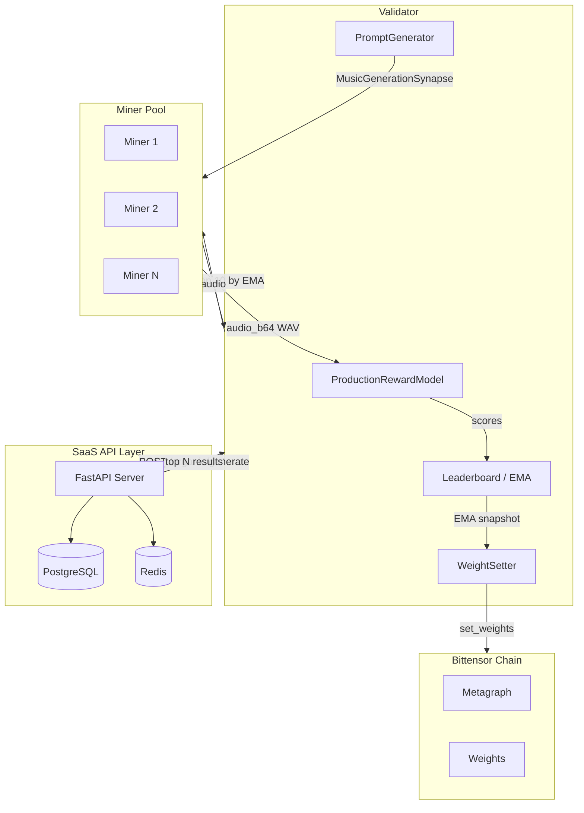
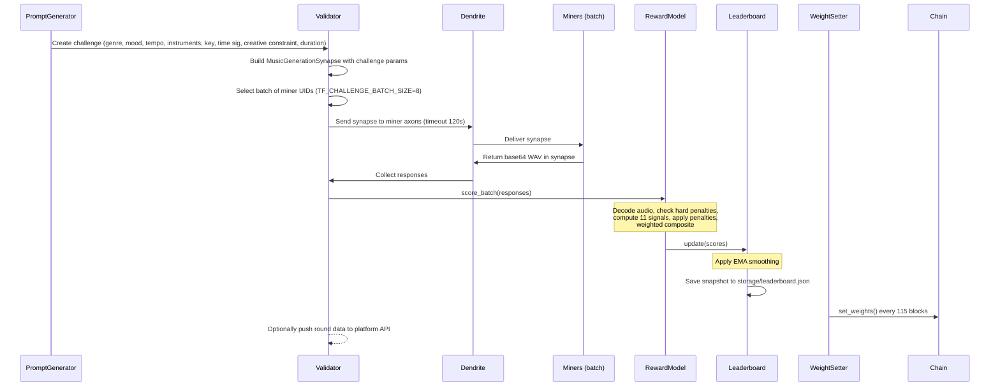
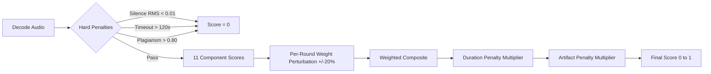
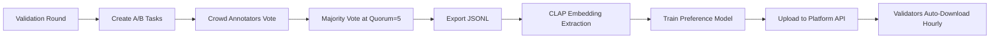

# TuneForge Setup Guide

Complete reference for deploying and operating the TuneForge music generation subnet on Bittensor. This document covers system architecture, protocol definitions, deployment methods, environment configuration, scoring internals, and development workflow.

---

## Table of Contents

1. [Architecture Overview](#architecture-overview)
2. [Validation Flow](#validation-flow)
3. [Organic Generation Flow](#organic-generation-flow)
4. [Scoring Pipeline](#scoring-pipeline)
5. [Protocol Definitions](#protocol-definitions)
6. [Prerequisites](#prerequisites)
7. [Installation](#installation)
8. [Network Configuration](#network-configuration)
9. [Deployment: Docker](#deployment-docker)
10. [Deployment: PM2](#deployment-pm2)
11. [Environment Variable Reference](#environment-variable-reference)
12. [Database and Persistence](#database-and-persistence)
13. [Security Model](#security-model)
14. [Annotation System](#annotation-system)
15. [Development](#development)

---

## Architecture Overview

TuneForge is a Bittensor subnet for AI music generation. Validators issue challenges to miners, score the returned audio across 11 dimensions, maintain an EMA leaderboard, and set on-chain weights. The validator also serves an organic generation API (port 8090) that the SaaS backend calls for real-time music generation. An optional SaaS API layer provides user authentication and a credit system.



---

## Validation Flow

The validation loop runs continuously on each validator node.



Step-by-step:

1. **PromptGenerator** creates a challenge with genre, mood, tempo, instruments, key signature, time signature, creative constraint, and duration.
2. Validator constructs a `MusicGenerationSynapse` populated with the challenge parameters.
3. Validator selects a batch of miner UIDs (`TF_CHALLENGE_BATCH_SIZE`, default 8).
4. Dendrite sends the synapse to miner axons with a timeout of 120 seconds.
5. Miners generate audio and return base64-encoded WAV data in the synapse response.
6. `ProductionRewardModel.score_batch()` scores all responses (see [Scoring Pipeline](#scoring-pipeline)).
7. `Leaderboard.update()` applies EMA smoothing to the raw scores.
8. The leaderboard snapshot is persisted to `storage/leaderboard.json`.
9. `WeightSetter.set_weights()` submits on-chain weights every 115 blocks.
10. Optionally, the validator pushes round data to the platform API for the SaaS layer.

---

## Organic Generation Flow

Organic requests from the SaaS backend flow through the validator's built-in HTTP API (port 8090):

```
SaaS Backend → POST /organic/generate → Validator
Validator → fan-out to top 10 miners by EMA (30s timeout)
Validator → score all responses (same 11-signal pipeline)
Validator → update EMA leaderboard
Validator → return top N results to SaaS Backend
```

The validator runs the organic API server and the challenge validation loop concurrently on the same asyncio event loop. Scoring models are protected by a lock, and CPU-bound scoring runs in a thread pool executor so organic requests aren't blocked by challenge rounds.

---

## Scoring Pipeline

Each miner response passes through the full scoring pipeline within `ProductionRewardModel.score_batch()`.



### Hard Penalties

Any of the following results in an immediate score of 0:

| Condition | Threshold |
|-----------|-----------|
| Silence | RMS < 0.01 |
| Timeout | > 120 seconds |
| Self-plagiarism | Fingerprint similarity > 0.80 |

### Scoring Components

| Component | Weight | Description |
|-----------|--------|-------------|
| `clap` | 0.30 | CLAP text-audio cosine similarity (prompt adherence) |
| `musicality` | 0.10 | Rhythmic and harmonic analysis |
| `neural_quality` | 0.10 | MERT-based neural audio quality assessment |
| `production` | 0.08 | Production quality (mixing, mastering characteristics) |
| `melody` | 0.07 | Melodic coherence and development |
| `structural` | 0.07 | Structural completeness (intro, development, outro) |
| `quality` | 0.06 | Classic audio quality sub-metrics |
| `preference` | 0.06 | Learned preference model (or bootstrap heuristic) |
| `vocal` | 0.06 | Vocal quality when vocals are present |
| `diversity` | 0.05 | Output diversity across rounds |
| `speed` | 0.05 | Generation speed (validator-measured round-trip time) |
| `attribute` | 0.00 | Attribute verification (reserved, currently disabled) |

Weight distribution rationale: prompt adherence (30%), music quality spread across eight independent scorers (60%), and diversity plus speed (10%). Artifact detection is applied as a penalty multiplier, not as a weighted component.

### Audio Quality Sub-Weights

The `quality` component is itself a weighted sum of five sub-metrics:

| Sub-Metric | Weight |
|------------|--------|
| Harmonic ratio | 0.25 |
| Onset quality | 0.20 |
| Spectral contrast | 0.20 |
| Temporal variation | 0.20 |
| Dynamic range | 0.15 |

### Anti-Gaming: Weight Perturbation

Each validation round applies a random perturbation of up to +/-20% to the composite weights, seeded deterministically by `challenge_id`. This prevents miners from over-optimizing for a single fixed weight distribution.

### Leaderboard EMA

Raw round scores are smoothed with exponential moving average (alpha = 0.2). The steepening function applies a power transform (power 2.0) above a baseline of 0.50 to separate high-quality miners from the rest: `((ema - 0.50) / 0.50) ^ 2.0`.

---

## Protocol Definitions

All synapse classes are defined in `tuneforge/base/protocol.py`.

### MusicGenerationSynapse

**Request fields** (validator to miner):

| Field | Type | Default | Description |
|-------|------|---------|-------------|
| `prompt` | `str` | `""` | Text prompt describing desired music |
| `genre` | `str` | `""` | Target genre |
| `mood` | `str` | `""` | Target mood |
| `tempo_bpm` | `int` | `120` | Desired BPM (20--300) |
| `duration_seconds` | `float` | `10.0` | Desired duration in seconds (1--60) |
| `key_signature` | `str \| None` | `None` | Musical key signature |
| `time_signature` | `str \| None` | `None` | Time signature |
| `instruments` | `list[str] \| None` | `None` | Preferred instruments |
| `reference_audio` | `str \| None` | `None` | Base64-encoded reference audio |
| `seed` | `int \| None` | `None` | Random seed for reproducibility |
| `challenge_id` | `str` | `""` | Unique challenge ID |
| `is_organic` | `bool` | `False` | Organic query vs validator challenge |

**Response fields** (miner to validator):

| Field | Type | Default | Description |
|-------|------|---------|-------------|
| `audio_b64` | `str \| None` | `None` | Base64-encoded WAV audio |
| `sample_rate` | `int \| None` | `None` | Sample rate in Hz |
| `generation_time_ms` | `int \| None` | `None` | Generation time in milliseconds |
| `model_id` | `str \| None` | `None` | Model identifier string |

**Hash fields:** `prompt`, `genre`, `mood`, `tempo_bpm`, `duration_seconds`, `challenge_id`

### PingSynapse

Used by validators to discover online miners and their capabilities before sending challenges.

**Request field:**

| Field | Type | Description |
|-------|------|-------------|
| `version_check` | `str \| None` | Validator protocol version for compatibility check |

**Response fields:**

| Field | Type | Description |
|-------|------|-------------|
| `is_available` | `bool` | Whether the miner is available for generation requests |
| `supported_genres` | `list[str]` | Genres the miner's model supports |
| `supported_durations` | `list[float]` | Supported generation durations in seconds |
| `gpu_model` | `str` | GPU model name |
| `max_concurrent` | `int` | Maximum concurrent generation requests |
| `version` | `str` | Miner software version |

### HealthReportSynapse

Validators collect these metrics to monitor miner health and reliability.

| Field | Type | Description |
|-------|------|-------------|
| `gpu_utilization` | `float` | GPU utilization percentage (0--100) |
| `gpu_memory_used_mb` | `float` | GPU memory used in MB |
| `cpu_percent` | `float` | CPU utilization percentage (0--100) |
| `memory_percent` | `float` | System memory utilization percentage (0--100) |
| `generations_completed` | `int` | Total generations completed since startup |
| `average_generation_time_ms` | `float` | Rolling average generation time in ms |
| `uptime_seconds` | `float` | Miner uptime in seconds |
| `errors_last_hour` | `int` | Errors encountered in the last hour |

---

## Prerequisites

### Hardware

**Miner (GPU required):**

- NVIDIA GPU with at least 16 GB VRAM (A100 40GB recommended)
- 32 GB system RAM minimum
- 100 GB SSD storage
- CUDA 12.1+ and NVIDIA drivers installed

**Validator (CPU-only):**

- 8+ CPU cores
- 16 GB system RAM minimum
- 50 GB SSD storage
- No GPU required (scoring models run on CPU)

### Software

- Python 3.10 or 3.11
- pip and venv
- ffmpeg and libsndfile1
- Git
- Docker and Docker Compose (for containerized deployment)
- PM2 and Node.js (for process-managed deployment)
- A registered Bittensor wallet with hotkey

---

## Installation

### 1. Clone the repository

```bash
git clone https://github.com/your-org/tuneforge.git
cd tuneforge
```

### 2. Create and activate a virtual environment

```bash
python3.11 -m venv venv
source venv/bin/activate
```

### 3. Install system dependencies

```bash
sudo apt-get update && sudo apt-get install -y ffmpeg libsndfile1 git curl
```

### 4. Install Python dependencies

```bash
pip install -r requirements.txt
pip install -e .
```

### 5. Create a Bittensor wallet (if you do not have one)

```bash
btcli wallet create --wallet.name my-wallet
btcli wallet new_hotkey --wallet.name my-wallet --wallet.hotkey my-hotkey
```

### 6. Register on the subnet

**Testnet (netuid 234):**

```bash
btcli subnet register --wallet.name my-wallet --wallet.hotkey my-hotkey --netuid 234 --subtensor.network test
```

### 7. Configure environment

Copy the example environment file and edit it:

```bash
cp .env.miner.example .env.miner    # For miners
cp .env.validator.example .env.validator  # For validators
```

All environment variables use the `TF_` prefix. See the [Environment Variable Reference](#environment-variable-reference) section for the complete list.

---

## Network Configuration

| Parameter | Testnet | Mainnet |
|-----------|---------|---------|
| Netuid | 234 | TBD |
| Subtensor network | `test` | `finney` |
| Miner axon port | Configurable (`TF_AXON_PORT`), example: 8091 | Same |
| Validator axon port | Example: 8092 | Same |
| API server port | 8000 (`TF_API_PORT`) | Same |
| Subtensor endpoint | Configurable via `TF_SUBTENSOR_CHAIN_ENDPOINT` | Same |

---

## Deployment: Docker

The `docker-compose.yml` defines five services. Use whichever subset matches your role.

### Services

| Service | Image / Dockerfile | Port Mapping | GPU | Depends On |
|---------|--------------------|--------------|-----|------------|
| `miner` | `Dockerfile.miner` (NVIDIA CUDA 12.1.1) | 8091, 8000 | Yes (1x NVIDIA) | -- |
| `validator` | `Dockerfile.validator` (python:3.11-slim) | 8092 | No | -- |
| `api` | `Dockerfile.miner` (runs uvicorn) | 8080 -> 8000 | Yes (1x NVIDIA) | postgres, redis |
| `postgres` | `postgres:16-alpine` | 5432 | No | -- |
| `redis` | `redis:7-alpine` (maxmemory 256mb, allkeys-lru) | 6379 | No | -- |

### Volumes

- `./storage:/app/storage` -- leaderboard snapshots and audio files
- `~/.bittensor/wallets:/root/.bittensor/wallets:ro` -- wallet access (read-only)
- `pgdata` -- PostgreSQL persistent data

### Commands

```bash
# Miner only
docker compose up miner -d

# Validator only
docker compose up validator -d

# Full stack (miner + validator + API + postgres + redis)
docker compose up -d

# View logs
docker compose logs -f miner
docker compose logs -f validator

# Stop everything
docker compose down
```

Environment files are loaded via `env_file` directives: `.env.miner` for the miner and api services, `.env.validator` for the validator service.

The miner Dockerfile pre-downloads the `facebook/musicgen-medium` model at build time. The validator Dockerfile pre-downloads the `laion/larger_clap_music` CLAP model. This avoids download delays at first startup.

---

## Deployment: PM2

The `ecosystem.config.js` defines five PM2 processes. All use `autorestart: true`, `max_restarts: 10`, and configurable restart delays.

### Processes

| Process Name | Script | Restart Delay | Notes |
|--------------|--------|---------------|-------|
| `tuneforge-miner-1` | `neurons.miner --env-file .env.miner` | 5000 ms | `PYTHONUNBUFFERED=1` |
| `tuneforge-miner-2` | `neurons.miner --env-file .env.miner2` | 5000 ms | `PYTHONUNBUFFERED=1`, second miner instance |
| `tuneforge-validator` | `neurons.validator --env-file .env.validator` | 5000 ms | `CUDA_VISIBLE_DEVICES=-1` (CPU-only) |
| `tuneforge-api` | `uvicorn tuneforge.api.server:app --host 0.0.0.0 --port 8000` | 3000 ms | Requires `TF_DB_URL`, `TF_JWT_SECRET`, etc. |
| `tuneforge-web` | `npm run dev` (in `/home/borgg/tuneforge-web`) | 3000 ms | Next.js frontend |

### Commands

```bash
# Start all processes
pm2 start ecosystem.config.js

# Check status
pm2 status

# View logs (all or specific)
pm2 logs
pm2 logs tuneforge-miner-1

# Restart a specific process
pm2 restart tuneforge-validator

# Stop all
pm2 stop all

# Delete all managed processes
pm2 delete all
```

---

## Environment Variable Reference

All variables use the `TF_` prefix and are loaded via `pydantic-settings` (for `settings.py`) or `os.environ` (for `scoring_config.py`).

### Network

| Variable | Type | Default | Description |
|----------|------|---------|-------------|
| `TF_NETUID` | int | `0` | Subnet network UID |
| `TF_VERSION` | str | `1.0.0` | Software version |
| `TF_SUBTENSOR_NETWORK` | str | `None` | Subtensor network (finney, test, local) |
| `TF_SUBTENSOR_CHAIN_ENDPOINT` | str | `None` | Custom chain endpoint URL |
| `TF_BURN_UID` | int | `0` | UID to burn weight to |
| `TF_BURN_WEIGHT` | float | `0.0` | Weight fraction to burn |

### Wallet

| Variable | Type | Default | Description |
|----------|------|---------|-------------|
| `TF_WALLET_NAME` | str | `default` | Wallet coldkey name |
| `TF_WALLET_HOTKEY` | str | `default` | Hotkey name |
| `TF_WALLET_PATH` | str | `~/.bittensor/wallets` | Wallet directory path |

### Neuron

| Variable | Type | Default | Description |
|----------|------|---------|-------------|
| `TF_MODE` | str | `miner` | Runtime mode: `miner` or `validator` |
| `TF_NEURON_EPOCH_LENGTH` | int | `100` | Blocks between weight updates |
| `TF_NEURON_TIMEOUT` | int | `120` | Forward timeout in seconds |
| `TF_NEURON_AXON_OFF` | bool | `false` | Disable axon serving |
| `TF_AXON_PORT` | int | `None` | Axon port for serving requests |

### Generation (Miner)

| Variable | Type | Default | Description |
|----------|------|---------|-------------|
| `TF_MODEL_NAME` | str | `facebook/musicgen-medium` | MusicGen model name or path |
| `TF_GENERATION_MAX_DURATION` | int | `30` | Maximum generation duration (seconds) |
| `TF_GENERATION_SAMPLE_RATE` | int | `32000` | Audio sample rate in Hz |
| `TF_GENERATION_TIMEOUT` | int | `120` | Timeout for generation requests (seconds) |
| `TF_GPU_DEVICE` | str | `cuda:0` | GPU device for model inference |
| `TF_MODEL_PRECISION` | str | `float16` | Model precision: float32, float16, bfloat16 |
| `TF_GUIDANCE_SCALE` | float | `3.0` | Classifier-free guidance scale |
| `TF_TEMPERATURE` | float | `1.0` | Sampling temperature |
| `TF_TOP_K` | int | `250` | Top-K sampling (0 = disabled) |
| `TF_TOP_P` | float | `0.0` | Nucleus sampling (0 = disabled) |

### Validation

| Variable | Type | Default | Description |
|----------|------|---------|-------------|
| `TF_VALIDATION_INTERVAL` | int | `300` | Seconds between validation rounds |
| `TF_CHALLENGE_BATCH_SIZE` | int | `8` | Miners challenged per round |
| `TF_MAX_CONCURRENT_VALIDATIONS` | int | `4` | Maximum concurrent validation tasks |

### Scoring Weights

All weights must sum to 1.0. Override any individual weight via its environment variable.

| Variable | Default | Component |
|----------|---------|-----------|
| `TF_WEIGHT_CLAP` | `0.30` | CLAP prompt adherence |
| `TF_WEIGHT_QUALITY` | `0.06` | Classic audio quality |
| `TF_WEIGHT_MUSICALITY` | `0.10` | Musicality analysis |
| `TF_WEIGHT_PRODUCTION` | `0.08` | Production quality |
| `TF_WEIGHT_MELODY` | `0.07` | Melody coherence |
| `TF_WEIGHT_NEURAL_QUALITY` | `0.10` | MERT neural quality |
| `TF_WEIGHT_PREFERENCE` | `0.06` | Preference model |
| `TF_WEIGHT_STRUCTURAL` | `0.07` | Structural completeness |
| `TF_WEIGHT_VOCAL` | `0.06` | Vocal quality |
| `TF_WEIGHT_DIVERSITY` | `0.05` | Output diversity |
| `TF_WEIGHT_SPEED` | `0.05` | Generation speed |
| `TF_WEIGHT_ATTRIBUTE` | `0.00` | Attribute verification (reserved) |

### Audio Quality Sub-Weights

Must sum to 1.0. These control the internal breakdown of the `quality` component.

| Variable | Default | Sub-Metric |
|----------|---------|------------|
| `TF_QW_HARMONIC_RATIO` | `0.25` | Harmonic ratio |
| `TF_QW_ONSET_QUALITY` | `0.20` | Onset quality |
| `TF_QW_SPECTRAL_CONTRAST` | `0.20` | Spectral contrast |
| `TF_QW_DYNAMIC_RANGE` | `0.15` | Dynamic range |
| `TF_QW_TEMPORAL_VARIATION` | `0.20` | Temporal variation |

### Scoring Thresholds

| Variable | Type | Default | Description |
|----------|------|---------|-------------|
| `TF_SELF_PLAGIARISM_THRESHOLD` | float | `0.80` | Fingerprint similarity above which a response is plagiarized |
| `TF_SILENCE_THRESHOLD` | float | `0.01` | RMS below which audio is considered silent |
| `TF_DURATION_TOLERANCE` | float | `0.20` | Acceptable duration deviation (fraction) |
| `TF_DURATION_TOLERANCE_MAX` | float | `0.50` | Maximum duration deviation before zero score |
| `TF_WEIGHT_PERTURBATION` | float | `0.20` | Per-round weight perturbation range (+/-), 0 to disable |

### EMA / Leaderboard

| Variable | Type | Default | Description |
|----------|------|---------|-------------|
| `TF_EMA_ALPHA` | float | `0.2` | EMA smoothing factor (higher = faster adaptation) |
| `TF_EMA_WARMUP` | int | `9` | Warmup rounds (kept for reference, no longer used as a gate) |
| `TF_STEEPEN_BASELINE` | float | `0.50` | Score baseline for steepening function |
| `TF_STEEPEN_POWER` | float | `2.0` | Exponent for steepening above baseline |
| `TF_WEIGHT_UPDATE_INTERVAL` | int | `115` | Blocks between on-chain weight submissions |
| `TF_METAGRAPH_SYNC_INTERVAL` | int | `1200` | Seconds between metagraph syncs |

### Speed Scoring

| Variable | Type | Default | Description |
|----------|------|---------|-------------|
| `TF_SPEED_BEST_SECONDS` | float | `5.0` | Generation time for maximum speed score |
| `TF_SPEED_MID_SECONDS` | float | `30.0` | Generation time for mid-range score |
| `TF_SPEED_MID_SCORE` | float | `0.3` | Score at mid-range generation time |
| `TF_SPEED_MAX_SECONDS` | float | `60.0` | Generation time at which speed score is 0 |

### Duration

| Variable | Type | Default | Description |
|----------|------|---------|-------------|
| `TF_DEFAULT_DURATION` | float | `10.0` | Default generation duration in seconds |
| `TF_MAX_DURATION` | float | `60.0` | Maximum allowed duration |
| `TF_MIN_DURATION` | float | `1.0` | Minimum allowed duration |
| `TF_DEFAULT_GUIDANCE_SCALE` | float | `3.0` | Default classifier-free guidance scale |

### CLAP

| Variable | Type | Default | Description |
|----------|------|---------|-------------|
| `TF_CLAP_MODEL` | str | `laion/clap-htsat-unfused` | CLAP model for text-audio similarity |
| `TF_CLAP_SAMPLE_RATE` | int | `48000` | CLAP model input sample rate |
| `TF_CLAP_SIM_FLOOR` | float | `0.15` | Cosine similarity floor (maps to score 0) |
| `TF_CLAP_SIM_CEILING` | float | `0.60` | Cosine similarity ceiling (maps to score 1) |

### MERT

| Variable | Type | Default | Description |
|----------|------|---------|-------------|
| `TF_MERT_MODEL` | str | `m-a-p/MERT-v1-95M` | MERT model for neural audio quality |
| `TF_MERT_SAMPLE_RATE` | int | `24000` | MERT model input sample rate |
| `TF_MERT_TEMPORAL_CENTER` | float | `0.85` | Temporal coherence bell curve center |
| `TF_MERT_TEMPORAL_WIDTH` | float | `12.5` | Temporal coherence bell curve width |
| `TF_MERT_LAYER_CENTER` | float | `0.6` | Layer agreement bell curve center |
| `TF_MERT_LAYER_WIDTH` | float | `8.0` | Layer agreement bell curve width |
| `TF_MERT_PERIODICITY_CENTER` | float | `0.5` | Periodicity bell curve center |
| `TF_MERT_PERIODICITY_WIDTH` | float | `8.0` | Periodicity bell curve width |
| `TF_MERT_EXPECTED_NORM` | float | `25.0` | Expected feature norm for normalization |

### LUFS

| Variable | Type | Default | Description |
|----------|------|---------|-------------|
| `TF_LUFS_TOLERANCE` | float | `4.0` | LUFS loudness tolerance (dB) |

### Preference Model

| Variable | Type | Default | Description |
|----------|------|---------|-------------|
| `TF_PREFERENCE_MODEL_PATH` | str | `None` | Path to trained PreferenceHead checkpoint (.pt) |

### API / Server

| Variable | Type | Default | Description |
|----------|------|---------|-------------|
| `TF_API_HOST` | str | `0.0.0.0` | API server bind host |
| `TF_API_PORT` | int | `8000` | API server port |
| `TF_API_MAX_QUEUE_SIZE` | int | `100` | Maximum pending API requests |
| `TF_STORAGE_PATH` | str | `./storage` | Local storage path for snapshots and audio |
| `TF_FRONTEND_URL` | str | `http://localhost:3000` | Frontend URL (used for CORS) |
| `TF_VALIDATOR_API_URL` | str | `""` | Platform API base URL for validator data push |
| `TF_VALIDATOR_API_TOKEN` | str | `""` | Bearer token for validator-to-API authentication |
| `TF_ORGANIC_API_ENABLED` | bool | `true` | Enable organic generation API on validator |
| `TF_ORGANIC_API_PORT` | int | `8090` | Port for the validator's organic API |

### Logging

| Variable | Type | Default | Description |
|----------|------|---------|-------------|
| `TF_LOG_LEVEL` | str | `INFO` | Log level (DEBUG, INFO, WARNING, ERROR) |
| `TF_LOG_DIR` | str | `/tmp/tuneforge` | Directory for log files |

### Monitoring

| Variable | Type | Default | Description |
|----------|------|---------|-------------|
| `TF_WANDB_ENABLED` | bool | `false` | Enable Weights & Biases logging |
| `TF_WANDB_ENTITY` | str | `None` | W&B entity (team or username) |
| `TF_WANDB_PROJECT` | str | `tuneforge` | W&B project name |

---

## Database and Persistence

TuneForge uses different storage backends depending on the component:

| Component | Backend | Location |
|-----------|---------|----------|
| Miner leaderboard (EMA scores) | In-memory, JSON snapshot | `storage/leaderboard.json` |
| Plagiarism fingerprints | SQLite | `fingerprints.db` |
| SaaS user accounts, credits, API keys | PostgreSQL (asyncpg) | Configured via `TF_DB_URL` |
| Rate limiting, SSE pub/sub | Redis | Default port 6379 |
| Audio files | Local filesystem (fallback) or platform API | `storage/` directory |

### PostgreSQL Schema

Managed by Alembic async migrations in `alembic/`. Key tables include users, API keys, credits, generation records, validation rounds, annotation tasks, annotations, and preference models.

### Running Migrations

```bash
# Apply all pending migrations
alembic upgrade head

# Generate a new migration after model changes
alembic revision --autogenerate -m "describe change"
```

---

## Security Model

### Validator Stake Filtering

Miners verify the caller's stake before accepting generation requests. The minimum required stake is 1000.0 TAO (`MIN_GENERATION_STAKE`). This prevents unauthorized nodes from extracting generations.

### Hotkey Authentication

Validators sign API requests using the `HotkeyAuth` class, which signs a payload consisting of `nonce.hotkey.method.path.bodyhash`. This provides cryptographic proof of validator identity.

### Bearer Token Fallback

For development environments, bearer token authentication is available as an alternative to hotkey signing.

### Speed Scoring Integrity

Speed scores use the validator-measured round-trip time (`dendrite.process_time`), not the miner-reported `generation_time_ms`. This prevents miners from falsifying their generation speed.

### SaaS API Authentication

The API layer supports three authentication modes:

1. **JWT authentication** -- access tokens (15 min) and refresh tokens (7 days) for user sessions.
2. **API key authentication** -- long-lived keys for programmatic access.
3. **Legacy environment variable authentication** -- for backward compatibility.

### Validator-to-API Service Token

Validators push data to the platform API using a service token (`TF_VALIDATOR_SERVICE_TOKEN` / `TF_VALIDATOR_API_TOKEN`), verified by the `require_validator_token` dependency.

---

## Annotation System

TuneForge includes a crowd annotation system for training preference models via A/B comparisons.

### Pipeline



### Key Details

- **Task creation:** A/B comparison tasks are generated from validation round outputs.
- **Voting:** Each user can vote once per task (`UNIQUE(task_id, user_id)`).
- **Aggregation:** Majority vote at quorum (default 5 annotators). Ties are discarded.
- **Export:** `GET /annotations/export` returns JSONL format compatible with `train_preference.py`.
- **Training:** `tools/export_and_train.py` handles export, CLAP embedding extraction, training, and model upload.
- **Auto-update:** Validators check `GET /annotations/model/latest` once per hour and download if the SHA has changed.

### Database Tables

- `annotation_tasks` -- A/B comparison task definitions
- `annotations` -- individual user votes
- `preference_models` -- trained model metadata and storage

### API Endpoints

Eight endpoints under `/annotations/`: task listing, voting, statistics, export, and model upload/download. See `tuneforge/api/routes/annotations.py`.

---

## Development

### Running Tests

```bash
pytest tests/
```

Tests use `pytest-asyncio` in auto mode. Coverage reporting is available via `pytest-cov`.

### Adding a New Scorer

1. Create a new class in `tuneforge/scoring/` (see existing scorers for the interface pattern).
2. Register it in `ProductionRewardModel` (the batch scoring orchestrator).
3. Add a weight key to the `SCORING_WEIGHTS` dictionary in `tuneforge/config/scoring_config.py`.
4. Set the default weight and add a `TF_WEIGHT_<NAME>` environment variable.

Existing scorer modules:

| Module | File |
|--------|------|
| CLAP prompt adherence | `tuneforge/scoring/clap_scorer.py` |
| Audio quality | `tuneforge/scoring/audio_quality.py` |
| Musicality | `tuneforge/scoring/musicality.py` |
| Production quality | `tuneforge/scoring/production_quality.py` |
| Melody coherence | `tuneforge/scoring/melody_coherence.py` |
| Neural quality (MERT) | `tuneforge/scoring/neural_quality.py` |
| Preference model | `tuneforge/scoring/preference_model.py` |
| Structural completeness | `tuneforge/scoring/structural_completeness.py` |
| Vocal quality | `tuneforge/scoring/vocal_quality.py` |
| Diversity | `tuneforge/scoring/diversity.py` |
| Attribute verifier | `tuneforge/scoring/attribute_verifier.py` |
| Plagiarism detection | `tuneforge/scoring/plagiarism.py` |
| Artifact detection | `tuneforge/scoring/artifact_detector.py` |
| Genre profiles | `tuneforge/scoring/genre_profiles.py` |

### Modifying Scoring Weights

Update defaults in `tuneforge/config/scoring_config.py`, or override at runtime via `TF_WEIGHT_*` environment variables. Weights must sum to 1.0.

### Calibrating MERT Parameters

Use the calibration tool to tune MERT bell-curve parameters against a sample of real audio:

```bash
python tools/calibrate_mert.py
```

This adjusts `TF_MERT_TEMPORAL_CENTER`, `TF_MERT_TEMPORAL_WIDTH`, `TF_MERT_LAYER_CENTER`, `TF_MERT_LAYER_WIDTH`, `TF_MERT_PERIODICITY_CENTER`, and `TF_MERT_PERIODICITY_WIDTH`.

### Project Layout

```
tuneforge/
  tuneforge/
    __init__.py              # VERSION, NETUID, constants
    settings.py              # Pydantic-settings singleton (TF_ prefix)
    base/
      protocol.py            # Synapse definitions
    config/
      scoring_config.py      # Scoring weights and thresholds
    scoring/                 # 14 scorer modules
    api/
      server.py              # FastAPI application
      auth.py                # 3-mode authentication
      jwt_auth.py            # JWT + password hashing
      credits.py             # Credit system
      validator_api.py       # Organic generation API (runs inside validator)
      redis_manager.py       # Rate limiting + SSE pub/sub
      sse.py                 # Server-sent events
      validator_auth.py      # Validator service token auth
      database/
        models.py            # SQLAlchemy models
        engine.py            # Async engine setup
        crud.py              # Database operations
      routes/
        auth.py              # Auth endpoints
        credits.py           # Credit endpoints
        keys.py              # API key endpoints
        generate.py          # Generation endpoints
        validator.py         # Validator data push endpoints
        annotations.py       # Annotation endpoints
  neurons/
    miner.py                 # Miner entrypoint
    validator.py             # Validator entrypoint
  tools/
    export_and_train.py      # Preference model training pipeline
    calibrate_mert.py        # MERT parameter calibration
  alembic/                   # Database migrations
  docker-compose.yml         # Docker service definitions
  ecosystem.config.js        # PM2 process definitions
  Dockerfile.miner           # NVIDIA CUDA 12.1.1 image
  Dockerfile.validator       # Python 3.11-slim image
  requirements.txt           # Python dependencies
```
